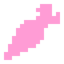
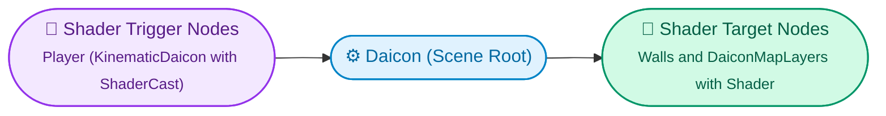

# Creating Your Game

With the basic scene setup complete, let's build out a full gameplay loop: bring the character to life with animations, connect realistic drop shadows, and configure silhouette x-ray shaders for elevated walls.

> [!TIP] Node Creation Tip
> Avoid duplicating Daicon nodes with `Ctrl+D` if unique slot resources have already been assigned to them. It is much cleaner to create new nodes fresh from the node palette or save pre-configured characters as reusable sub-scenes (`.tscn`).

---

## 1. Assembling the Character

Add a **KinematicDaicon** node to your scene and attach the standard 2D components as children:

* **Sprite2D** — the character sprite sheet or texture.
* **Camera2D** — tracking camera.
* **AnimationPlayer** & **AnimationTree** — to drive state transitions (Idle, Move, Jump).

Now let's slot 3D physical shapes into the core:

1. Create a temporary **CollisionShape3D** in your scene tree (e.g. with a `CapsuleShape3D` shape).
2. In the `KinematicDaicon` inspector, assign this node into the **Shape Node** slot.
3. The node will disappear from the 2D tree and inject directly into the hidden 3D core.
4. *(Optional)* Assign a matching collision shape to **Whisker Shape Node** to ensure the character sorts behind walls accurately.

> [!INFO] Verifying the Core
> Look at the **Slots** group in the inspector: the parameter dictionary will be populated, and 3D collision wireframes will appear in the 3D viewport. Clicking the reset icon next to the slot will immediately unpack the node back into the visible scene tree.

---

## 2. Character Script & Animation Logic

Extend the script of your `KinematicDaicon` (Right-click node → **«Extend Script»** → select the `KinematicDaicon` template).

Here is a ready-to-run 8-directional movement script with jumping, gravity, and `AnimationTree` blend positions:

```gdscript
@tool
extends KinematicDaicon

const SPEED := 5.0
const JUMP_VELOCITY := 5.0
const GRAVITY := 10.0
const ACCELERATION := 20.0

@onready var animation_tree: AnimationTree = $AnimationTree
@onready var animation_playback = animation_tree.get("parameters/playback")

var movement_input := Vector2.ZERO

func _physics_process(delta: float) -> void:
    if Engine.is_editor_hint(): return
    
    var body := core as CharacterBody3D
    if not body: return

    # 1. Read 2D input vector
    movement_input = Input.get_vector("ui_left", "ui_right", "ui_up", "ui_down")
    var direction := Vector3(movement_input.x, 0.0, movement_input.y).normalized()
    
    # 2. Feed movement direction into the animation blend tree
    if direction != Vector3.ZERO:
        set_animation_direction(movement_input)

    # 3. Horizontal acceleration and gravity
    var y_vel := body.velocity.y
    body.velocity = body.velocity.move_toward(direction * SPEED, ACCELERATION * delta)
    body.velocity.y = y_vel - GRAVITY * delta

    # 4. Jump execution
    if Input.is_action_just_pressed("ui_accept") and body.is_on_floor():
        body.velocity.y += JUMP_VELOCITY

    # 5. Move and synchronize the 2D sprite
    body.move_and_slide()
    update_player_animation(direction, body.velocity)
    update_pos()


func update_player_animation(direction: Vector3, velocity: Vector3) -> void:
    var body := core as CharacterBody3D
    if not body or not animation_playback: return

    if velocity.x == 0 and velocity.z == 0:
        animation_playback.travel("Idle")
    else:
        if body.is_on_floor():
            animation_playback.travel("Move")
        else:
            animation_playback.travel("Jump")


func set_animation_direction(direction: Vector2) -> void:
    if not animation_tree: return
    animation_tree.set("parameters/Idle/blend_position", direction)
    animation_tree.set("parameters/Move/blend_position", direction)
    animation_tree.set("parameters/Jump/blend_position", direction)
```

---

## 3. Adding a Realistic Shadow

> 
> 
> Shadows in Daicon require zero manual wiring — they scan the terrain automatically.

1. Add a **DaiconShadow** node as a child of your `KinematicDaicon` character.
2. Assign your shadow blob texture to the sprite's `Texture` property.
3. Enable **Debug Ray** in the inspector to visualize the real floor scanner ray.
4. If needed, tweak `footprint_radius` (ground support radius) and `pivot_offset` (pixel offset beneath character feet).

The shadow will automatically detect floor elevation changes during jumps and smoothly fade out as altitude increases.

---

## 4. Setting Up Silhouette Shaders

The primary purpose of the root **Daicon** node is revealing characters whenever they walk behind elevated walls or roofs:



1. Make sure your character has a `RayCast3D` assigned to the **Shader Cast Node** slot.
2. Select the root **Daicon** node in your scene.
3. Add your player to the **Shader Trigger Nodes** list.
4. Add walls or `DaiconMapLayer` layers that should reveal characters into the **Shader Target Nodes** list.
5. Attach one of the cutout shader materials from `addons/daicon/shaders/` to those target layers.

---

## Other Entity Types

* **[StaticDaicon](../node-reference/static_daicon.md):** Use for static props, obstacles, and walls.
* **[AnimatedDaicon](../node-reference/animated_daicon.md):** Use for moving platforms, doors, and traps.
* **[RigidDaicon](../node-reference/rigid_daicon.md):** Use for physics-driven boxes, rolling barrels, and debris.