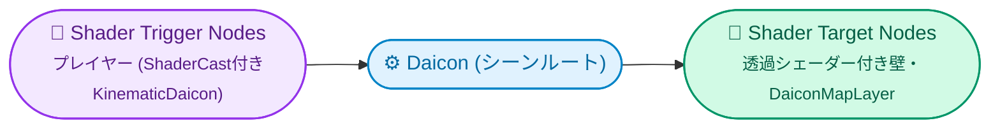

# ゲームの作成

基本シーンの準備が整ったら、実際のゲームプレイを構築していきましょう。アニメーションを実装し、リアルな影を投影し、壁の背後に隠れた際のシルエット透過シェーダーを設定します。

> [!TIP] ノード作成のコツ
> すでに固有のスロットリソースが割り当てられているDaiconノードを `Ctrl+D` で安易に複製することは避けてください。新規ノードとして追加するか、設定済みのキャラクターを再利用可能なシーン（`.tscn`）として保存する方が安全です。

---

## 1. キャラクターの組み立て

シーンに **KinematicDaicon** ノードを追加し、子ノードとして通常の2Dコンポーネントを配置します：

* **Sprite2D** — キャラクタースプライト。
* **Camera2D** — 追従カメラ。
* **AnimationPlayer** および **AnimationTree** — 状態遷移管理（Idle, Move, Jump）。

次に、3Dコリジョン形状をコアへ登録します：

1. シーンツリー上に一時的な **CollisionShape3D** ノード（例: `CapsuleShape3D`）を作成します。
2. `KinematicDaicon` のインスペクタで、作成したノードを **Shape Node** スロットに設定します。
3. ノードが2Dツリーから消え、非表示の3Dコア内部へ自動的に注入されます。
4. *(任意)* 壁の後ろに隠れた際の前後関係を正しく処理するため、**Whisker Shape Node** にも形状を設定します。

> [!INFO] コアの状態を確認する
> インスペクタの **Slots** グループにパラメータ辞書が記録され、3Dビューポートにワイヤーフレームが表示されます。スロット横のリセットアイコンを押せば、ノードはいつでも通常のシーンツリーへ復元されます。

---

## 2. 操作スクリプトとアニメーション制御

`KinematicDaicon` のスクリプトを拡張します（ノード右クリック → **「スクリプトを拡張」** → `KinematicDaicon` テンプレートを選択）。

以下は、8方向移動、ジャンプ、重力、`AnimationTree` のブレンド制御を含む実践的なコード例です：

```gdscript
@tool
extends KinematicDaicon

const SPEED := 5.0
const JUMP_VELOCITY := 5.0
const GRAVITY := 10.0
const ACCELERATION := 20.0

@onready var animation_tree: AnimationTree = $AnimationTree
@onready var animation_playback = animation_tree.get("parameters/playback")

var movement_input := Vector2.ZERO

func _physics_process(delta: float) -> void:
    if Engine.is_editor_hint(): return
    
    var body := core as CharacterBody3D
    if not body: return

    # 1. 2D入力ベクトルの読み取り
    movement_input = Input.get_vector("ui_left", "ui_right", "ui_up", "ui_down")
    var direction := Vector3(movement_input.x, 0.0, movement_input.y).normalized()
    
    # 2. 移動方向をアニメーションのブレンドツリーへ反映
    if direction != Vector3.ZERO:
        set_animation_direction(movement_input)

    # 3. 水平方向の加速と重力演算
    var y_vel := body.velocity.y
    body.velocity = body.velocity.move_toward(direction * SPEED, ACCELERATION * delta)
    body.velocity.y = y_vel - GRAVITY * delta

    # 4. ジャンプ処理
    if Input.is_action_just_pressed("ui_accept") and body.is_on_floor():
        body.velocity.y += JUMP_VELOCITY

    # 5. 移動の実行と2Dスプライト同期
    body.move_and_slide()
    update_player_animation(direction, body.velocity)
    update_pos()


func update_player_animation(direction: Vector3, velocity: Vector3) -> void:
    var body := core as CharacterBody3D
    if not body or not animation_playback: return

    if velocity.x == 0 and velocity.z == 0:
        animation_playback.travel("Idle")
    else:
        if body.is_on_floor():
            animation_playback.travel("Move")
        else:
            animation_playback.travel("Jump")


func set_animation_direction(direction: Vector2) -> void:
    if not animation_tree: return
    animation_tree.set("parameters/Idle/blend_position", direction)
    animation_tree.set("parameters/Move/blend_position", direction)
    animation_tree.set("parameters/Jump/blend_position", direction)
```

---

## 3. リアルな影の追加

> 
> 
> Daiconの影は手動の座標計算を必要とせず、地形の高さを自動スキャンします。

1. **DaiconShadow** ノードを `KinematicDaicon` キャラクターの子として追加します。
2. スプライトの `Texture` プロパティに影用テクスチャを設定します。
3. インスペクタで **Debug Ray** を有効にして、床面スキャナーの光線を表示させます。
4. 必要に応じて `footprint_radius`（接地半径）や `pivot_offset`（足元のオフセット）を調整します。

ジャンプ中も自動的に足元の高さを検知し、高度が上がるにつれて影が滑らかにフェードアウトします。

---

## 4. シルエット透過シェーダーの設定

ルートノード **Daicon** の重要な役割は、高い壁や屋根の背後に隠れたキャラクターを透過表示することです：


```mermaid
graph LR
    A(["🎯 Shader Trigger Nodes<br><small>プレイヤー (ShaderCast付きKinematicDaicon)</small>"]) --> B(["⚙️ Daicon (シーンルート)"])
    B --> C(["🧱 Shader Target Nodes<br><small>透過シェーダー付き壁・DaiconMapLayer</small>"])

    classDef purple fill:#f3e8ff,stroke:#9333ea,stroke-width:1.5px,color:#581c87;
    classDef blue fill:#e0f2fe,stroke:#0284c7,stroke-width:1.5px,color:#0369a1;
    classDef emerald fill:#d1fae5,stroke:#059669,stroke-width:1.5px,color:#065f46;

    class A purple;
    class B blue;
    class C emerald;
```

1. キャラクターの **Shader Cast Node** スロットに `RayCast3D` が設定されていることを確認します。
2. シーンのルートノード **Daicon** を選択します。
3. **Shader Trigger Nodes** リストにプレイヤーを追加します。
4. **Shader Target Nodes** リストに、透過させたい壁や `DaiconMapLayer` レイヤーを登録します。
5. それらのターゲット層のマテリアルに `addons/daicon/shaders/` フォルダ内の透過シェーダーを設定します。

---

## その他のエンティティタイプ

* **[StaticDaicon](../node-reference/static_daicon.md):** 静止した壁、障害物、装飾物に使用します。
* **[AnimatedDaicon](../node-reference/animated_daicon.md):** 移動プラットフォーム、扉、トラップに使用します。
* **[RigidDaicon](../node-reference/rigid_daicon.md):** 物理演算で転がる樽、木箱、瓦礫などに使用します。