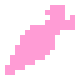

# Создание вашей игры

簡単に慣れて、シーンを設定したら、機能を作り始めよう。

まず、KinematicDaicon に必要なノードを追加します：

- Sprite2D
- Camera2D
- AnimationPlayer
- AnimationTree
- **MeshInstance3D と CollisionShape3D** と同様です。

KinematicDaicon の対応するセルに **Mesh** と **Shape** を配置する：

- セルパラメーターの 「assign 」ボタンをクリックします。  
- メッシュの希望のノードを選択します。  
- 同じことを **Shape** にも行う

!!!info
	「CORE」セクションをチェックする。セルを埋めた後、コアに割り当てられたパラメータのリストが自動的に更新された。さらに、コアの子ノードの数が1つ増えた。
	
	ベースラインに戻るアイコンをクリックしようとすると、セルとそのパラメータ・リストは空になり、さっきまでセルにあったノードがエディタの表示に戻る。これはセル自体の横にある同じアイコンをクリックした場合と同じである。
	
	(カーネルの機能の詳細については 「Manual:Core」 を参照）。

---
## コード

添付されている KinematicDaicon ノードの .gd ファイルに移動します。前のステップを正しく行った場合（特にスクリプトのオーバーライドが重要です）、コードは次のようになります：

```java
@tool
extends KinematicDaicon

func _ready() -> void:
	super._ready()

func _process(delta: float) -> void:
	super._process(delta)

func _physics_process(delta: float) -> void:
	if not Engine.is_editor_hint():
		#LOGIC
	
		#LOGIC END
	
		#d3.move_and_slide()
		#update_pos()
		pass

func _validate_property(property: Dictionary) -> void:
	super._validate_property(property)

```

関数「_ready」、「_process」、および「_validate_property」には「super」構造が含まれています。オーバーライドしたノードのルート ファイルで同じ関数を呼び出します。したがって、このコードは、親ノードの機能を変更せずに何らかの方法で使用します。

次に、ロジックとアニメーション・システムを追加しよう：

```java
@tool
extends KinematicDaicon

const SPEED = 5
const JUMP_VELOCITY = 5
const gravity = 10
const accelaration = 20
@onready var animation_tree : AnimationTree = $AnimationTree
@onready var animation = animation_tree.get("parameters/playback")

var movement_input := Vector2.ZERO

func _ready() -> void:
	super._ready()
	
func _process(delta: float) -> void:
	super._process(delta)
	
func _validate_property(property: Dictionary) -> void:
	super._validate_property(property)

func _physics_process(delta: float) -> void:
	if not Engine.is_editor_hint():
		movement_input = Input.get_vector("ui_left", "ui_right", "ui_up", "ui_down")
		var direction := Vector3(movement_input.x, 0, movement_input.y).normalized()
		if direction != Vector3.ZERO:
			set_animation_direction(movement_input)
		
		var y_vel = d3.velocity.y
		d3.velocity = d3.velocity.move_toward(direction * SPEED, accelaration * delta)
		d3.velocity.y = y_vel - gravity * delta
		
		if Input.is_action_just_pressed("ui_accept") and d3.is_on_floor():
			d3.velocity.y += JUMP_VELOCITY
			
		d3.move_and_slide()
		player_animation(direction, d3.velocity)
		update_pos()

func player_animation(direction, d3_velocity):
	if d3_velocity == Vector3.ZERO:
		animation.travel("Idle")
	elif d3_velocity != Vector3.ZERO:
		if direction:
			if d3.is_on_floor():
				animation.travel("Move")
			else:
				animation.travel("Jump")
		else:
			if not d3.is_on_floor():
				animation.travel("Jump Down")

func set_animation_direction(direction):
	animation_tree.set("parameters/Idle/blend_position", direction)
	animation_tree.set("parameters/Move/blend_position", direction)
	animation_tree.set("parameters/Jump/blend_position", direction)
	animation_tree.set("parameters/Jump Down/blend_position", direction)
```

---
## StaticDaicon - AnimatedDaicon

> 
>
> 
>
> 静的オブジェクトには、**StaticDaicon** と **AnimatedDaicon** ノードを使用してください。これらの違いは、StaticBody と AnimatedBody の違いと類似しています。
>
>両ノードの設定と動作の原理は、KinematicDaicon と同様です。

---
## RigidDaicon


> 
>
> 複雑な物理特性を持つオブジェクトには**RigidDaicon**が利用可能です。

---
## DaiconShadow

> 
>
> DaiconShadow ノードは、**CharacterBody3D** コアを内蔵した2次元スプライトです。親ダイコン ノードを入力として受け取り、そのコアのデータを使用してオブジェクトの下に影を生成します。


- 入力ノードを**Daicon Parent**パラメーターに配置します（このノードが影を投影します）
- **tile_size** と **z_step** のパラメーターは自動的に親と同期されます
- **min_distance** と **max_distance** の値を設定します（詳細は「Node Reference : DaiconShadow」セクションを参照）
- **Shadow Mode** を選択します - 影のモジュレーションモード （フェードと彩度）
- **Stream Mode** を選択してください - 物理ボディのコアの動作モード（詳細は「Node Reference : DaiconShadow」セクションを参照）
- **Shape** を追加（shape.size.y = 0 は必要な平面衝突モデルを作成します）

次に、**Shape セクション** は影の衝突を動的に変更するために使用され、設定が完了すると必要ありません - 影は完成です。

---
## シェーダー

Daicon ルート・ノードの主な目的は、シェーダーを描画することです。

ノードのパラメータ・パネルには、トリガーとターゲットの2つのリストがあります。

- トリガーは、ShaderCast などのカーネル内のシェーダーデザインメカニズムを含むノードです。  
- ターゲットは、トリガーから情報を受け取り、指定された座標にシェーダーを描画するノードです。

Daiconは、エフェクトの動的な更新、リストの並べ替え、トリガーの状態の分析などを行う。

!!!Info
	プラグインは基本的なシェーダーも提供しており、アドオンディレクトリの 「shaders 」フォルダにあります。

シェーダを使用する環境ノードを選択します。**DaiconMap** の場合、レイヤーが抽出されている場合は、レイヤーごとにシェーダーを設定する必要があります。

あとはトリガーとターゲットのリストを埋めれば設定は完了です。