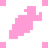
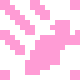

# Создание вашей игры

После краткого ознакомления и настройки сцены, приступим к созданию её функционала. 

Прежде всего добавим все необходимые ноды к KinematicDaicon: 

- Sprite2D
- Camera2D
- AnimationPlayer
- AnimationTree
- а также **MeshInstance3D и CollisionShape3D**.

Поместите **Mesh** и **Shape** в соответствующие ячейки KinematicDaicon:

- Нажмите на кнопку "назначить" в параметре ячейки
- Выберите нужную ноду меша
- Аналогично сделайте для **Shape**

!!!info
	Проверьте раздел "Core". После заполнения ячеек, список параметров, отведенный им в ядре, обновился автоматически. Кроме того, на единицу увеличилось число дочерних узлов ядра. 
	
	При попытке нажать на значок возвращения к базовому значению, ячейка и список её параметров опустеют, а нода что находилась в ячейке ранее вернется в видимость редактора. Аналогично, если бы вы нажали на тот же значок возле самой ячейки.
	
	(Подробнее о функционировании ядра смотрите в разделе "Manual : Core")

---
## Код

Перейдите к прикрепленному .gd файлу вашей ноды KinematicDaicon. Если вы сделали правильно прошлые шаги (особенно важно переопределение скрипта), сейчас ваш код выглядит так:

```java
@tool
extends KinematicDaicon

func _ready() -> void:
	super._ready()

func _process(delta: float) -> void:
	super._process(delta)

func _physics_process(delta: float) -> void:
	if not Engine.is_editor_hint():
		#LOGIC
	
		#LOGIC END
	
		#d3.move_and_slide()
		#update_pos()
		pass

func _validate_property(property: Dictionary) -> void:
	super._validate_property(property)

```

Функции "_ready", "_process" и "_validate_property" содержат конструкцию "super". Она вызывает эти же функции у корневого файла ноды, который вы переопределили. Таким образом этот код использует функционал своей материнской ноды некоим образом не меняя её.

Теперь добавим логику и систему анимации:

```java
@tool
extends KinematicDaicon

const SPEED = 5
const JUMP_VELOCITY = 5
const gravity = 10
const accelaration = 20
@onready var animation_tree : AnimationTree = $AnimationTree
@onready var animation = animation_tree.get("parameters/playback")

var movement_input := Vector2.ZERO

func _ready() -> void:
	super._ready()
	
func _process(delta: float) -> void:
	super._process(delta)
	
func _validate_property(property: Dictionary) -> void:
	super._validate_property(property)

func _physics_process(delta: float) -> void:
	if not Engine.is_editor_hint():
		movement_input = Input.get_vector("ui_left", "ui_right", "ui_up", "ui_down")
		var direction := Vector3(movement_input.x, 0, movement_input.y).normalized()
		if direction != Vector3.ZERO:
			set_animation_direction(movement_input)
		
		var y_vel = d3.velocity.y
		d3.velocity = d3.velocity.move_toward(direction * SPEED, accelaration * delta)
		d3.velocity.y = y_vel - gravity * delta
		
		if Input.is_action_just_pressed("ui_accept") and d3.is_on_floor():
			d3.velocity.y += JUMP_VELOCITY
			
		d3.move_and_slide()
		player_animation(direction, d3.velocity)
		update_pos()

func player_animation(direction, velocity):
	if velocity == Vector3.ZERO:
		animation.travel("Idle")
	elif velocity != Vector3.ZERO:
		if direction:
			if d3.is_on_floor():
				animation.travel("Move")
			else:
				animation.travel("Jump")
		else:
			if not d3.is_on_floor():
				animation.travel("Jump Down")

func set_animation_direction(direction):
	animation_tree.set("parameters/Idle/blend_position", direction)
	animation_tree.set("parameters/Move/blend_position", direction)
	animation_tree.set("parameters/Jump/blend_position", direction)
	animation_tree.set("parameters/Jump Down/blend_position", direction)
```

---
## Статичные обьекты

Для статических обьектов используйте ноды **StaticDaicon** и **AnimatedDaicon**. Их отличия можно сравнить с отличиями StaticBody и AnimatedBody.

Принцип настройки и функционирования обеих нод схож с KinematicDaicon.





!!!tip
	Старайтесь не копировать ноды-дайкон. Это может способствовать возникновением непредвиденных ошибок.
	Вместо этого создавайте ноды вручную.

---
## Шейдеры

Главная цель корневой ноды Daicon - прорисовка шейдеров.

На панели параметров ноды, присутствуют два списка: триггеры и цели.

- Триггерами являются ноды содержащие в ядре механизмы проектирования шейдеров, такие как ShaderCast.
- Цели - это ноды, которые принимают информацию от триггеров и рисуют шейдер в заданных для них координат.

Daicon занимается динамическим обновлением эффектов, сортировкой списков и анализом состояния триггеров.

!!!Info
	Плагин также предоставляет базовые шейдеры, которые вы можете найти в директории аддона, в папке "shaders".

Выберите ноды окружение, которые будут использовать шейдер. Для **DaiconMap**, в случае если слои были извлечены, шейдер нужно поставить для каждого такого слоя отдельно.

Теперь достаточно заполнить список триггеров и целей, и настройка завершена.