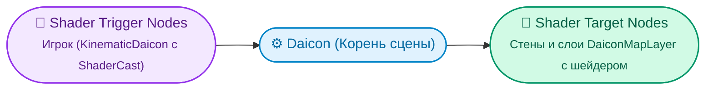

# Создание вашей игры

После настройки базовой сцены перейдем к созданию полноценного игрового процесса: оживим персонажа, подключим анимации, добавим тень и настроим шейдеры просвечивания стен.

> [!TIP] Совет по созданию нод
> Старайтесь не дублировать Daicon-ноды через `Ctrl+D`, если в них уже назначены уникальные ресурсы слотов. Надежнее создавать новые ноды через панель добавления узлов или делать из настроенных персонажей переиспользуемые сцены (`.tscn`).

---

## 1. Сборка персонажа

Добавьте в сцену узел **KinematicDaicon** и прикрепите к нему дочерние 2D-узлы:

* **Sprite2D** — текстура персонажа.
* **Camera2D** — следящая камера.
* **AnimationPlayer** и **AnimationTree** — для управления состояниями анимации (Idle, Move, Jump).

Теперь назначим 3D-формы в ядро:

1. Создайте во временном дереве сцены узел **CollisionShape3D** (например, с формой `CapsuleShape3D`).
2. В инспекторе `KinematicDaicon` укажите созданный узел в слоте **Shape Node**.
3. Узел исчезнет из 2D-дерева и внедрится внутрь скрытого 3D-ядра.
4. *(Опционально)* Назначьте форму в **Whisker Shape Node**, чтобы персонаж корректно перекрывался стенами.

> [!INFO] Как проверить ядро?
> В инспекторе в группе **Slots** заполнится словарь параметров, а в 3D-вьюпорте появится коллизия. Если нажать на иконку сброса рядом со слотом, узел тут же вернется обратно в видимое дерево сцены.

---

## 2. Код управления и анимации

Расширьте скрипт вашего `KinematicDaicon` (ПКМ по ноде → **«Расширить скрипт»** → шаблон `KinematicDaicon`).

Вот готовый рабочий скрипт с 8-направленным движением, прыжком и переключением анимаций через `AnimationTree`:

```gdscript
@tool
extends KinematicDaicon

const SPEED := 5.0
const JUMP_VELOCITY := 5.0
const GRAVITY := 10.0
const ACCELERATION := 20.0

@onready var animation_tree: AnimationTree = $AnimationTree
@onready var animation_playback = animation_tree.get("parameters/playback")

var movement_input := Vector2.ZERO

func _physics_process(delta: float) -> void:
    if Engine.is_editor_hint(): return
    
    var body := core as CharacterBody3D
    if not body: return

    # 1. Считываем вектор ввода
    movement_input = Input.get_vector("ui_left", "ui_right", "ui_up", "ui_down")
    var direction := Vector3(movement_input.x, 0.0, movement_input.y).normalized()
    
    # 2. Передаем направление в бленд-дерево анимаций
    if direction != Vector3.ZERO:
        set_animation_direction(movement_input)

    # 3. Горизонтальное ускорение и гравитация
    var y_vel := body.velocity.y
    body.velocity = body.velocity.move_toward(direction * SPEED, ACCELERATION * delta)
    body.velocity.y = y_vel - GRAVITY * delta

    # 4. Прыжок
    if Input.is_action_just_pressed("ui_accept") and body.is_on_floor():
        body.velocity.y += JUMP_VELOCITY

    # 5. Движение и синхронизация 2D-спрайта
    body.move_and_slide()
    update_player_animation(direction, body.velocity)
    update_pos()


func update_player_animation(direction: Vector3, velocity: Vector3) -> void:
    var body := core as CharacterBody3D
    if not body or not animation_playback: return

    if velocity.x == 0 and velocity.z == 0:
        animation_playback.travel("Idle")
    else:
        if body.is_on_floor():
            animation_playback.travel("Move")
        else:
            animation_playback.travel("Jump")


func set_animation_direction(direction: Vector2) -> void:
    if not animation_tree: return
    animation_tree.set("parameters/Idle/blend_position", direction)
    animation_tree.set("parameters/Move/blend_position", direction)
    animation_tree.set("parameters/Jump/blend_position", direction)
```

---

## 3. Добавление реалистичной тени

> 
> 
> Тень в Daicon не требует сложной ручной привязки — она сканирует пол автоматически.

1. Добавьте узел **DaiconShadow** дочерним элементом к вашему персонажу `KinematicDaicon`.
2. Назначьте текстуру тени в свойство `Texture` спрайта.
3. Включите **Debug Ray** в инспекторе, чтобы увидеть реальный луч сканера пола.
4. При необходимости настройте `footprint_radius` (радиус опоры) и `pivot_offset` (смещение текстуры под ноги).

Тень сама найдет поверхность под персонажем при прыжках и начнет плавно растворяться в воздухе.

---

## 4. Настройка силуэтных шейдеров

Главная задача корневого узла **Daicon** — просвечивать персонажей, когда они скрываются за высокими стенами или крышами:


```mermaid
graph LR
    A(["🎯 Shader Trigger Nodes<br><small>Игрок (KinematicDaicon с ShaderCast)</small>"]) --> B(["⚙️ Daicon (Корень сцены)"])
    B --> C(["🧱 Shader Target Nodes<br><small>Стены и слои DaiconMapLayer с шейдером</small>"])

    classDef purple fill:#f3e8ff,stroke:#9333ea,stroke-width:1.5px,color:#581c87;
    classDef blue fill:#e0f2fe,stroke:#0284c7,stroke-width:1.5px,color:#0369a1;
    classDef emerald fill:#d1fae5,stroke:#059669,stroke-width:1.5px,color:#065f46;

    class A purple;
    class B blue;
    class C emerald;
```

1. Убедитесь, что у персонажа в слоте **Shader Cast Node** назначен луч `RayCast3D`.
2. Выберите корневую ноду **Daicon** в сцене.
3. В список **Shader Trigger Nodes** добавьте вашего персонажа.
4. В список **Shader Target Nodes** добавьте стены или слои `DaiconMapLayer`, которые должны становиться прозрачными.
5. Назначьте на материалы этих слоев шейдер из папки `addons/daicon/shaders/`.

---

## Другие типы объектов

* **[[static_daicon.ru|StaticDaicon]]:** Используйте для неподвижных декораций, стен и заборов.
* **[[animated_daicon.ru|AnimatedDaicon]]:** Используйте для движущихся платформ, лифтов и ловушек.
* **[[rigid_daicon.ru|RigidDaicon]]:** Используйте для физических ящиков, бочек и катящихся камней.