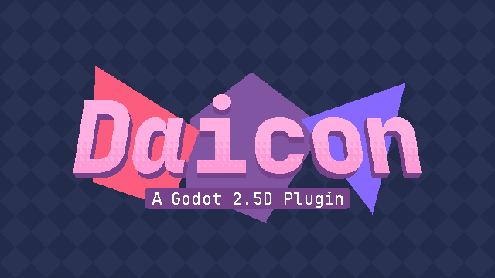

# Start of Work

**Daicon** is a Godot plugin for creating 2.5D games. 

Its principle is to use 3D space to move 2D objects. In this way it simulates the 3D depth of the environment in 2D dimension.

The addon provides the developer with a set of new nodes and additional tools that combine 3D and 2D capabilities simultaneously.

---
## Installation
### - **Godot Asset Library** <small>(recommended)</small>

The plugin is loaded into the Asset Library, from where you can install it directly into the project.

To do this, you need to go to the “Asset Library” section in the open window of the game engine or use the **Godot Asset Library** website

---
### - **GitHub**

The project's open source code, as well as all of its available releases, is hosted on the **[GitHub](https://github.com/arukurei/Daicon)** platform.

Let's install **Daicon**:

- Download the ZIP file of the desired version of the addon from the “Releases” section
- Unzip the archive containing the plugin folder
- Move the extracted folder to the addons directory of your project.

Now let's check the correctness of the installation:

- You have the path to the `res://addons/daicon` folder
- Go to Project > Project Settings
- Click on the Plugins section
- Check the enable button next to Daicon

---
### - **ItchIO**

You can also download the releases at **[ItchIO](https://alkrei.itch.io/daicon)**.

---
## **Can I use Daicon in my projects?**

Yes, you can use Daicon to create any games, even commercial ones! The project is developed under the MIT license. All we ask is that you remember to give us credit in your project! 
  
If you would like to be featured on the “Made with Daicon” page, contact me:

- [Discord](https://discordapp.com/users/595514733491126272)
- [Telegram](https://t.me/arukurei)