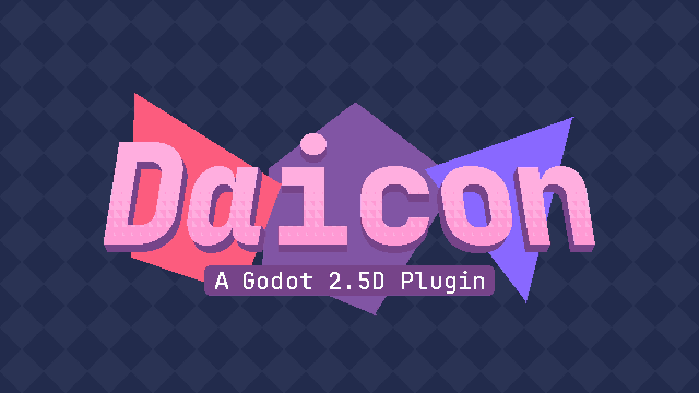

# はじめる

**Daicon** は、2.5Dゲームを作成するためのGodotプラグインです。

その原理は、3D空間を使って2Dオブジェクトを動かすことです。この方法で、2次元の環境の3D奥行きをシミュレートします。

このアドオンは、3Dと2Dの機能を同時に組み合わせる新しいノードと追加ツールのセットを開発者に提供します。

---
## インストール
### - **Godot Asset Library** <small>(推奨)</small>

プラグインはAsset Libraryにロードされ、そこからプロジェクトに直接インストールすることができます。

これを行うには、ゲームエンジンの開いているウィンドウの 「Asset Library 」セクションに行くか、**Godot Asset Library**のウェブサイトを使用する必要があります。

---
### - **GitHub**

プロジェクトのオープンソース・コードと利用可能なすべてのリリースは、**[GitHub](https://github.com/arukurei/Daicon)** プラットフォーム上でホストされている。

では、**Daicon** をインストールしてみよう：

- リリース "セクションから希望するバージョンのアドオンのZIPファイルをダウンロードします。
- プラグインフォルダを含むアーカイブを解凍します。
- 解凍したフォルダをプロジェクトのaddonsディレクトリに移動します。

では、正しくインストールされているか確認してみよう：

- `res://addons/daicon`フォルダへのパスがあります。  
- プロジェクト > プロジェクト設定  
- Pluginsセクションをクリックする。  
- Daiconの横にある有効化ボタンにチェックを入れる

---
### - **ItchIO**

リリースは **[ItchIO](https://alkrei.itch.io/daicon)** からもダウンロードできます。

---
## **Daicon** をプロジェクトに使用できますか？

そう、Daiconを使えば、商用であっても、どんなゲームでも作ることができる！プロジェクトはMITライセンスの下で開発されています。私たちがお願いしているのは、プロジェクトへの感謝の気持ちを忘れないことです！

もし「Made with Daicon」のページで紹介されたい場合は、私にご連絡ください：

- [Discord](https://discordapp.com/users/595514733491126272)
- [Telegram](https://t.me/arukurei)