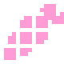
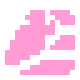

# Setup

## Daicon-Nodes 

First of all, let's familiarize ourselves with the new nodes. Each node is a two-dimensional node with a three-dimensional filling. Thus the emphasis between the two spaces falls on the two-dimensionality.

The stuffing is called the core. It is packaged and it is not possible to interact with it directly. To interact with the kernel, the developer is given a panel of parameters containing those that can be changed. There are also the default parameters of the node on which the daikon node is based.

!!! note
    However, if you know what you are doing, you can access the kernel through code. In that case you will have full access to it and all its parameters.

---
## 1.First steps

>
> 
> First of all, add a node to your scene that will characterize the scene itself. This is basically a Node, Node2D or Node3D, but the plugin provides a **Daicon** for this.

!!! tip
	You can continue to use Node, Node2D and Node3D as scene root nodes if you don't need the DaiconNode functionality (more on that on the next page).

### Script override

As you may have noticed, there is a script already attached to the node. This is a script file that defines **ALL** nodes of this type.  Thus, it is the same for all of them and can never be edited.

Since all **Daicon** nodes will be different in your project in the future, you need to extend the script:

- Right click on the node
- In the pop-up menu click on “Extend script” item
- In the script attachment window that opens, check the box next to “Template”.
- Select the template provided by the plugin in advance
- choose a path to save it
- create the script

Now your .gd file is overridden and you can rewrite it without affecting the root code of the addon.

!!!Info
	When connecting, **Daicon** creates a templates folder in your project (if it does not exist) or uses an already created one. There it writes templates required for development.

---
## 2.Environment

To create an environment, the plugin offers 2 nodes with similar working principle but different purpose:

### - DaiconMap <small>(main environment node)</small>
> 
> 
> 
> Represents a set of **TileMapLayers**, which in turn are levels of your environment.
> 
> Each such layer contains a unique **z-index**, which is a measure of the height of this layer in space. In other words, **z-sorting** places objects along the modulo **Z** axis based on their index.

###  - DaiconMapLayer <small>(additional environment node)</small>
> 
> 
> 
> Represents a single local independent node **TileMapLayer** with an embedded core **DaiconMap**.
> 
> So **DaiconMapLayer** is a support node, or a node representing an individual element of your environment that needs special attention.

### Setting up the Environment

- Mesh Library - a library of meshes from which the 3D world will be constructed
- Physics Material - used to define physical properties, such as friction and elasticity, of individual tiles.
- Cell Size - size in meters for each 3D tile
- Collision Layer and Mask - collision layers for 3D
- Bake Navigation - bake a navigation grid for 3D
- Transform Rotation3D and Scale3D - customize rotation and scale of the core

As you may have noticed, many parameters are missing. This is to ensure the security and correctness of the kernel.
!!! Example
	For example, the **Transform Position3D** section is synchronized with **Position2D**. When moving a dicon node in its native 2D space, the 3D kernel changes its position accordingly.

!!! note
	Remember, you can always get absolute access to the kernel and all its parameters through code.

/// caption
<small>Position2D = Vector2D(0, 0); Position3D = Vecotr3D(0, 0, -0.5)</small>
///

/// caption
<small>Position2D = Vector2D(-163, -157); Position3D = Vecotr3D(-10.1875, 0, -10.3125)</small>
///

#### The Mesha Library

**DaiconMap** and **DaiconMapLayer** necessarily require the mesha library. It is the constructor for the 3D world.

You can use the basic set that comes with it or create your own (see “Manual : Mesh”).

Once the field is filled in, your tiles will have the **Item** parameter. It binds the corresponding mesh in your mesh library to the tile. Once the tile is placed on the map, the bound mesh will be projected in 3D space.

#### Creating DaiconMap layers

- Create several layers in the parameter panel for TileMap
- Give them appropriate z-indices
- Go to the TileMap section in the panel at the bottom of the screen
- In the expanded section, click on the tool button in the upper right corner
- Click on “Extract TileMap layers as separate TileMapLayer nodes” option

Now you have environment layers that are full-fledged **TileMapLayers** nodes.

You can also add new layers as child nodes to **DaiconMap**. In this case, you will need to carefully monitor the **y-sort-enabled = true** parameter.

As soon as you draw environments on at least one layer, it will appear in 3D.
It is important to realize that, given the projection, each layer above 0 is moved forward by one value, and each layer below it is moved backward by one. This creates a tilted perspective (Top-Down).

If it wasn't, the perspective would be a perfect view from the top (Top)

!!!warning
	This way of working has its own rendering rules. Pay attention to the order of each layer's tiles:
	
	
	///caption
	The lower the layer, the darker the color
	
	Red - side of blocks
	
	The number shows the z-index of the layer
	///

---
## 3.Player
> 
> 
> 
> The KinematicDaicon node is used for all kinematic objects. It contains everything necessary to create a moving and interacting object.

Create a player:

- Add a KinematicDaicon to your scene
- Extend the node script:
	- Right click on the node
	- Select “Extend script”.
	- Use the template provided by the plugin for KinematicDaicon
	- Select a save path
	- Create a new script

### Player Setup

- Tile Size - size of one tile (the value determines the number of pixels that the character passes equal to 1 meter)
- Y 3D - position of the character on the Z axis
- Mesh - cell for mash-node that is embedded in the core (after installation you can see it in the 3D section).
- Shape - a mesh for shape-node which is embedded in the core (needed for collisions).
- Mesh & Shape” section contains Transform parameters for Mesh and Shape
- Section “Slots” - cells for developer nodes if it is necessary to embed them into the core (communication only through code)
- Core” section - responsible for the state of the core

- Child Count - number of child nodes in the core
- Then dictionaries of node parameters for each cell (the dictionary is full if the cell is filled)
### RayCast

The **RayCast** category represents 4 customization sections for the RayCast3D nodes built into the core.

**Whiskers** monitor collisions and work in conjunction with **y** and **z-sorting** to render objects correctly. There are 3 of them: right, left and center. They determine whether the object is behind the fence or not.

**ShaderCast** is a special purpose node. Its purpose is to detect collisions with objects in front of the player and draw a shader based on that.

/// caption
Red is **Whiskers**.

Blue ray is **ShaderCast**
///