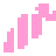
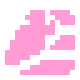

# 設定

## Daicon-Nodes

まず最初に、新しいノードについて知っておこう。各ノードは、3次元の詰め物をした2次元のノードである。したがって、2つの空間の間の重点は2次元にある。

詰め物はコアと呼ばれる。これはパッケージ化されており、直接操作することはできない。カーネルと対話するために、開発者は変更可能なパラメータを含むパラメータパネルを与えられる。また、daiconノードのベースとなるノードのデフォルト・パラメータもある。

!!! note

    しかし、自分が何をしているかわかっていれば、コードを通してカーネルにアクセスすることができる。この場合、カーネルとそのすべてのパラメーターにフルアクセスできる。

---
## 1.最初のステップ

>
> 
> まず最初に、シーンそのものを特徴付けるノードをシーンに追加します。これは基本的にNode、Node2DまたはNode3Dですが、プラグインはこのために **Daicon** を提供します。

!!! tip
	DaiconNode の機能が不要な場合は、Node、Node2D、Node3Dをシーンのルート・ノードとして使い続けることができます（これについては次のページで詳しく説明します）。

### スクリプト・オーバーライド

お気づきかもしれませんが、ノードにはすでにスクリプトが添付されています。これは、このタイプの**すべての**ノードを定義するスクリプト・ファイルです。 したがって、これらはすべて同じであり、ローカル機能のために編集することはできません。

将来的には、すべての **Daicon**ノードがプロジェクト内で異なるものになるため、スクリプトを拡張する必要があります：

- ノードを右クリックします。  
- ポップアップメニューで、「Extend Script」 アイテムをクリックします。  
- 開いたスクリプト添付ウィンドウで、「テンプレート 」オプションにチェックを入れます。  
- プラグインが提供するテンプレートをあらかじめ選択しておきます。  
- 保存するパスを選択します。  
- スクリプトを作成する

これで、.gd ファイルが再定義され、アドオンのルート コードに影響を与えることなくファイルを書き換えることができます。

!!!Info
	接続すると、**Daicon** はプロジェクトにテンプレートフォルダを作成します（存在しない場合）。このフォルダには、開発中に必要なテンプレートが書き込まれます。

---
## 2.環境

環境を構築するために、このプラグインは同じような動作原理で異なる目的を持つ2つのノードを提供します：

### - DaiconMap <small>(環境のメインノード)</small>
> 
> 
> 
> これは**TileMapLayers**のセットで、順番にあなたの環境のレベルになります。
> 
> このような各レイヤーは、空間におけるこのレイヤーの高さの尺度である一意の**z-インデックス**を含んでいる。言い換えれば、**z-ソート**は、そのインデックスに基づいて、モジュラー**Z**軸に沿ってオブジェクトを配置します (**Y** 軸（3D）)。

###  - DaiconMapLayer <small>(追加の環境ノード)</small>
> 
> 
> 
> コア **DaiconMap** が埋め込まれた単一のローカル独立ノード**TileMapLayer**を表す。
> 
> 言い換えれば、**DaiconMapLayer** はサポートノードであり、特別な注意を必要とする環境の明確な要素を表すノードである。

### 環境設定

- Mesh Library - 3D 世界が構築されるメッシュのライブラリ
- Physics Material - 個々のタイルの摩擦や弾性などの物理的特性を決定するために使用されます。
- Z Step - zインデックスのステップ（高さレベル間）
- Visible 3D - GridMapの3D表示
- Cell Size - 各 3D タイルのサイズ (メートル単位)
- Collision Layer そして Mask - 3D の衝突レイヤー
- Bake Navigation - 3D 用のナビゲーション メッシュをベイクする
- Transform Rotation3D そして Scale3D - カーネルの回転とスケールを調整する

お気づきかもしれないが、多くのパラメータが欠落している。これは、カーネル動作のセキュリティと正しさを確保するためである。

!!! Example
	例えば、**Transform Position3D**セクションは**Position2D**と同期しています。daicon-nodeをネイティブの2D空間で動かすと、3Dコアはそれに応じて位置を変更します。

!!! note
	覚えておいてほしいのは、カーネルとその全パラメーターへの絶対的なアクセスは、コードを通じていつでも可能だということだ。

/// caption
<small>Position2D = Vector2D(0, 0); Position3D = Vector3D(0, 0, -0.5)</small>
///

/// caption
<small>Position2D = Vector2D(-163, -157); Position3D = Vector3D(-10.1875, 0, -10.3125)</small>
///

#### Mesh Library

**DaiconMap**と**DaiconMapLayer**は必ずmeshaライブラリを必要とする。これは3Dワールドのコンストラクタである。

付属の基本キットを使ってもいいし、自分で作ってもいい。(セクション参照 "Manual : Mesh").

フィールドが埋められると、タイルは**Item**パラメータを持つようになります。これはメッシュライブラリの対応するメッシュをタイルにバインドします。タイルがマップ上に配置されると、バインドされたメッシュは3D空間でデザインされます。

!!! warning
	側面のタイル（例：赤いタイル）に対して、ローカルな z_index = -1 を設定してください。これにより、2つの壁がオブジェクトを密接に囲む場合に発生するソートエラーが解消されます。
	
	

#### DaiconMap レイヤーの作成

- TileMapのパラメータパネルに複数のレイヤーを作成する。  
- それらに適切なZインデックスを与える。  
- 画面下部のパネルでTileMapセクションに移動します。  
- 展開されたセクションで、右上のツールボタンをクリックします。  
- Extract TileMap layers as separate TileMapLayer nodes "オプションをクリックします。

これで本格的な**TileMapLayers**ノードである環境レイヤーができました。

新しいレイヤーを **DaiconMap** の子ノードとして追加することもできます。この場合、**y-sort-enabled = true** パラメータを注意深く監視する必要があります。

少なくとも1つのレイヤーに環境を描くとすぐに、それは3Dで表示される。  
ここで重要なのは、投影が行われると、0より上のレイヤーは1つ前に移動し、下のレイヤーは1つ後ろに移動するということだ。これにより、傾いた遠近感が生まれます。 (Top-Down).

そうでなかったら、このパースペクティブは上空からの完璧な眺めになるだろう (Top)

!!!warning
	Тこの原則にはレンダリングのルールがある。各レイヤーのタイルの配列順序に注意してください：
	
	
	///caption
	レイヤーが下になるほど色が暗くなります
	
	赤 - ブロックの側面
	
	番号は層の高さレベルを示します。zインデックスを知るには、レベルにZステップを乗算するだけで済みます。
	///

---
## 3.プレーヤー
> 
> 
> 
>KinematicDaiconノードは、すべてのキネマティックオブジェクトに使用されます。このノードには、動いて相互作用するオブジェクトを作成するために必要なものがすべて含まれています。

プレーヤーを作成しましょう:

- シーンにKinematicDaiconを追加する  
- ノードスクリプトを拡張する：
	- ノードを右クリック  
	- Extend Script "を選択します。  
	- KinematicDaiconのプラグインが提供するテンプレートを使用する。  
	- 保存パスを選択  
	- 新しいスクリプトを作成する

### プレーヤーの設定

- Tile Size - タイルサイズとは、3D空間において1メートルに相当するピクセル数を決定するものです。（要するに、3D空間におけるセルサイズあたりのタイルサイズを指します）
- Y 3D - Z軸上の文字位置 (**Y** 軸（3D）)
- Z Step - zインデックスのステップ（高さレベル間）
- Mesh - コアに埋め込まれたメッシュノードセル（インストール後、3Dセクションで見ることができる）
- Shape - コアに埋め込まれたシェイプノードのセル（衝突に必要）
- セクション "Mesh & Shape" - メッシュとシェイプのパラメーターを含みます。
- セクション "Slots" - カーネルに実装する必要がある場合、開発者ノード用のセル（コード経由の通信のみ）
- セクション "Core" - は原子核の状態に責任がある。

- Child Count - カーネル内の子ノードの数
- 次に、各セルのノード・パラメータのディクショナリ（セルが埋まっていればディクショナリは満杯）。

### RayCast

**RayCast** カテゴリは、コアに組み込まれたノード用の2つの設定セクションから構成されています：ShaderCast と Whisker。

**Whisker** は衝突を監視し、**y** と **z-ソート** と連携してオブジェクトを正しくレンダリングします。これは Area3D ノードであり、オブジェクトが障害物の後ろにあるかどうかを判断します。

!!!Info
	Whisker が正しく動作するように、1.1 メートル前方にシフトされています（オブジェクトの形状が 1x1x1 の立方体でない場合は、この値を調整してください）。これは、コアと相互作用する他のオブジェクトとの不要な衝突を回避するためです。
	
	さらに、Whisker の Shape 形状は、想定される衝突領域よりもやや小さくなければなりません。これは、エンジン自体の計算誤差による誤った衝突を回避するためです（浮動小数点数の問題に関連しています）。
	
	例えば、想定される領域が1x1x1の立方体である場合、Shapeのサイズは0.9x0.9x0.9となります。

**ShaderCast** - 特殊な目的のノードです。その目的は、プレイヤーの前方のオブジェクトとの衝突を検出し、その結果に基づいてシェーダーを描画することです。

/// caption
**Whisker** ゾーン

青い光線は **ShaderCast** です。
///