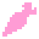
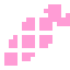
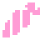
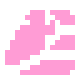

# セットアップ

## Daiconノードについて

Daiconの各ノードは、3Dの「中身」を持つ2Dノードです。実際の3D物理演算がバックグラウンドで動作しながら、開発ワークフローは親しみやすい2D空間で完結します。

内部の3D中身は **コア (core)** と呼ばれます。自動的に生成され、メモリ上に抽象的に存在します。開発者はインスペクタの使いやすいパラメータパネルからコアを自在に設定できます。

> [!NOTE] コードからの直接アクセス
> 物理挙動を細かく制御したい場合は、スクリプト内で `core` 変数を通じてコアへ直接アクセスし、3Dボディの全プロパティを操作できます。

---

## 1. 最初のステップ

> 
>  
> まず、シーンのルートノードを追加します。通常のGodotではNode2Dですが、本プラグインでは専用のルートノード **Daicon** を使用します。

> [!TIP] 
> グローバルなソート制御や壁裏シルエット透過シェーダーが不要な場合は、通常の `Node2D` をシーンルートとして使用しても問題ありません（詳細は [Daiconリファレンス](../node-reference/daicon.md) を参照）。

### スクリプトの拡張 (Override)

プラグインのノードには、エンジンの基本スクリプトがあらかじめアタッチされています。このファイルはその種類の**すべて**のノードの基本動作を定義しているため、直接編集してはいけません。

特定のオブジェクトに独自のゲームロジックを実装するには、スクリプトを拡張します：

1. シーンツリーでノードを右クリックします。
2. コンテキストメニューから **「スクリプトを拡張」** (Extend Script) を選択します。
3. 開いたダイアログで **「テンプレート」** (Template) にチェックを入れます。
4. プラグインが提供するテンプレートを選択します。
5. プロジェクト内の保存先パスを指定して **「作成」** をクリックします。

これで `.gd` ファイルが基本クラスを拡張し、安全に独自のコードを記述できるようになります。

> [!INFO]
> Daiconには `addons/script_templates/` フォルダにテンプレートが同梱されています。これらをプロジェクト全体で有効にするには、内容をプロジェクトルートの `script_templates/` フォルダ（デフォルトは `res://script_templates/`）へコピーしてください。

---

## 2. 環境の構築

ゲームワールドを作成するために、プラグインは2つのノードを提供しています：

### DaiconMap <small>(メイン環境ノード)</small>
> 
> 
> 多層構造のタイルマップです。各レイヤーは固有の **z-index** を持ち、これが空間内の高さレベルの基準となります。
> 
> つまり、**z-ソート** はインデックスに基づいて投影された奥行き軸（3Dの **Y** 軸）に沿ってオブジェクトを並べ替えます。

### DaiconMapLayer <small>(独立レイヤー)</small>
> 
> 
> 独自の `GridMap` コアを内蔵する単一の独立した `TileMapLayer` ノードです。
> 
> 取り外し可能な屋根、橋、破壊可能な足場、個別シェーダーが必要な装飾物に最適です。

---

### 環境の設定項目

* **Mesh Library:** 3Dワールドを構成するメッシュライブラリ。
* **Physics Material:** タイル表面の物理特性（摩擦と反発力）。
* **Z Step:** 高さレベル間のZインデックスのステップ幅。
* **Visible 3D:** ビューポート上での `GridMap` 3Dメッシュの表示切り替え。
* **Cell Size:** 3Dタイル1つのサイズ（メートル単位、デフォルトは `1x1x1`）。
* **Collision Layer and Mask:** 3D衝突レイヤー。
* **Bake Navigation:** 3Dナビゲーションメッシュのベイク設定。
* **Transform Rotation3D and Scale3D:** 3Dコアの回転とスケール。

> [!EXAMPLE] 座標の自動同期
> **Transform Position3D** セクションは **Position2D** と完全同期しています。Daiconノードを2D空間で移動させると、その3Dコアも自動的に3D位置を更新します。

/// caption
<small>Position2D = Vector2(0, 0); Position3D = Vector3(0, 0, -0.5)</small>
///

/// caption
<small>Position2D = Vector2(-163, -157); Position3D = Vector3(-10.1875, 0, -10.3125)</small>
///

---

#### メッシュライブラリの割り当て

**DaiconMap** と **DaiconMapLayer** にはメッシュライブラリ（`MeshLibrary`）が必須です。これはタイルの3D構成要素となります（[メッシュライブラリガイド](../manual/mesh.md) を参照）。

> [!TIP] スターターメッシュ
> Daiconに同梱されている標準のスターターキットメッシュを使用することもできます。

フィールドにライブラリを設定すると、`TileSet` 内にカスタムデータレイヤー **Item** が作成されます。これにより2Dタイルがライブラリ内のメッシュIDと紐付けられます。マップ上にタイルを描くと、対応する3Dブロックが空間に自動生成されます。

> [!WARNING] 側面の壁に関する重要なルール
> 垂直な側面の壁タイル（例の赤いタイル）には、**ローカル `z_index = -1`** を設定してください。これにより、キャラクターが2つの壁に挟まれた際のソートエラーを防ぐことができます。
> 
> 

---

#### DaiconMap レイヤーの作成手順

1. `TileMap` のインスペクタで複数のレイヤーを作成します。
2. `Z Step` の間隔で適切なZインデックス（例: 0, 10, 20）を設定します。
3. 画面下部の「TileMap」パネルを開きます。
4. 右上のツールメニューから **「TileMapレイヤーを個別のTileMapLayerノードとして抽出」** をクリックします。

これで、環境レイヤーが独立した `TileMapLayer` ノードとして展開されます。

> [!TIP]
> DaiconMapの子レイヤーごとに `y-sort-enabled = true` および `z_index & z_step` の値が正しく設定されているか注意深く確認してください。

2.5D投影により、0より上のレイヤーは1ステップ分（`z_step`）前方に、下のレイヤーは後方にシフトし、傾斜したTop-Downパースペクティブが生まれます：

> そうでない場合、パースペクティブは真上からのフラットな視点（Top）になってしまいます。

> [!WARNING] タイルの積み重ね順序
> 高低差のある地形を描く際は、タイルの配置順序に注意してください：
> 
> 
> /// caption
> - レイヤーが下になるほど色は暗くなります。
> - 赤色 — ブロックの側面。
> - 番号は高さレベルを示します。`z_index` を確認するには、レベル値に `z_step` を掛けます。
> ///

---

## 3. プレイヤーの作成

> 
> 
> キネマティックオブジェクトには **KinematicDaicon** ノードを使用します。動的な挙動、コリジョン、自動2.5Dソートに必要なすべてが揃っています。

### プレイヤーの作成手順:

1. シーンに **KinematicDaicon** ノードを追加します。
2. 右クリックメニューからスクリプトを拡張します（**「スクリプトを拡張」** → `KinematicDaicon` テンプレートを選択）。
3. ビジュアル用ノード（`Sprite2D`、`AnimationPlayer`、`AnimationTree` など）を子として追加します。

---

### プレイヤーのパラメータ設定

* **Tile Size:** ワールドスケール。3Dの1メートルに相当する画面ピクセル数（デフォルトは16）。
* **Y 3D:** 3Dワールドの垂直軸（Y軸）におけるキャラクター位置。
* **Z Step:** 高さレベル間のZインデックスステップ幅（`DaiconMap` と一致させる必要があります）。
* **Z Sort Coef:** 他のオブジェクトとの前後関係を判定するためのキャラクター自身の高さ係数。
* **Transform 3D:** 3Dコアの微調整グループ: 足元の原点オフセット（`offset_3d`）、回転（`rotation_3d`）、スケール（`scale_3d`）。

---

### スロットシステム (Slots)

Daiconでは、すべての3D物理コンポーネントが **スロット** を通じて割り当てられます。エディタ上で通常のノードを使って直感的に3Dボディを構築できます：

1. **Shape Node:** メインの衝突形状スロット（`CollisionShape3D` または `CollisionPolygon3D`）。
2. **Mesh Node:** ビジュアルやデバッグ用の3Dモデルスロット（`MeshInstance3D`）。
3. **Whisker Node & Whisker Shape Node:** 遮蔽検知センサー `Area3D` とその形状スロット。
4. **Shader Cast Node:** キャラクター前方の障害物を検知する `RayCast3D` 光線スロット。

> [!TIP] スロットへのノード登録方法
> シーンツリーで必要な3Dノード（例: `CollisionShape3D`）を作成し、`KinematicDaicon` を選択してインスペクタのスロット欄にそのノードを指定します。ノードは自動的にシリアライズされ、2Dツリーから削除されて非表示の3Dコア内部へ注入されます。

---

### センサー: Whisker と ShaderCast

キャラクターのコアには、2つの重要な空間認識ツールが組み込まれています：

* **Whisker (遮蔽検知センサー):** `Area3D` ノードです。キャラクターが高台や壁の背後に入ったことを検知し、`z_index` を動的に調整して壁の後ろへ正しく隠れるように制御します。
* **ShaderCast (透過シェーダー光線):** 前方／カメラ方向へ照射される `RayCast3D` です。壁に遮られたことを検知し、ルートノード `Daicon` へ信号を送ってシルエット透過を描画させます。

/// caption
- **Whisker** センサー領域（赤色）
- **ShaderCast**（青い光線）
///

> [!INFO] Whisker のサイズとオフセット
> * 正常な判定のため、**Whisker Shape** のコリジョン形状はキャラクター本体よりもわずかに小さく設定してください（例: 1x1x1 m の立方体の場合、ウィスカー形状は `0.9x0.9x0.9 m`）。タイルの継ぎ目での誤判定を防ぎます。
> * デフォルトで Whisker は前方に少し（1.1 m）オフセットされており、キャラクターの前にある障害物を正確に捉えます。