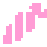
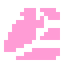

# Настройка

## Дайкон-Ноды 

Для начала познакомимся с новыми нодами. Каждая нода представляет собой двухмерную ноду с трехмерной начинкой. Таким образом акцент между двумя пространствами припадает на двухмерность.

Начинка называется ядром. Оно упаковано и взаимодействие с ним напрямую невозможно. Для взаимодействия с ядром разработчику дается панель параметров, содержащая те, которые можно менять. Там же находятся стандартные параметры ноды на которой основана нода-дайкон.

!!! note

    Тем не менее, если вы знаете что делаете, вы можете обратиться к ядру через код. В таком случае вы получите полный доступ к нему и всем его параметрам.

---
## 1.Первые шаги

>
> 
> В первую очередь добавьте в вашу сцену узел, который будет характеризовать саму сцену. В основном это Node, Node2D или Node3D, но плагин предоставляет для этого **Daicon**.

!!! tip
	Вы и дальше можете использовать Node, Node2D и Node3D, как корневые ноды сцены, если вам не требуется функционал DaiconNode (об этом на следующей странице).

[[kinematic_daicon.ru/]#]

### Переопределение скрипта

Как вы могли заметить, к ноде уже прикреплен скрипт. Это файл скрипта определяющий **ВСЕ** ноды данного типа.  Таким образом, он один для всех и его ни в коем случае нельзя редактировать для локального функционала.

Поскольку в дальнейшем в вашем проекте все ноды **Daicon** будут отличаться, вам нужно расширить скрипт:

- Нажмите правой кнопкой мыши на ноду
- Во всплывшем меню нажмите на пункт "Расширить скрипт"
- В открывшемся окне прикрепления скрипта поставьте галочку возле пункта "Шаблон"
- Выберете шаблон заранее предоставленный плагином
- выберите путь сохранения
- создайте скрипт

Теперь ваш .gd файл переопределен и вы можете переписывать его не влияя на корневой код аддона.

!!!Info
	При подключении, **Daicon** создает папку шаблонов в вашем проекте (если она отсутствует) или использует уже созданную. Туда он записывает шаблоны требуемые при разработке.

---
## 2.Окружение

Для создания окружения плагин предлагает 2 ноды со схожим принципом работы но разным назначением:

### - DaiconMap <small>(основная нода окружения)</small>
> 
> 
> 
> Представляет собой набор **TileMapLayers**, которые в свою очередь, являются уровнями вашего окружения.
> 
> Каждый такой слой содержит уникальный **z-индекс** являющийся показателем высоты данного слоя в пространстве. Другими словами **z-сортировка** размещает объекты по модулируемой оси **Z** на основе их индекса (ось **Y** в 3D).

###  - DaiconMapLayer <small>(дополнительная нода окружения)</small>
> 
> 
> 
> Представляет собой единую локальную независимую ноду **TileMapLayer** со встроенным ядром **DaiconMap**.
> 
> Таким образом **DaiconMapLayer** - это нода поддержки или нода, представляющая отдельный элемент вашего окружения, который требует особого внимания.

### Настройка Окружения

- Mesh Library - библиотека меша из которого будет строиться 3D мир
- Physics Material - используется для определения физических свойств, таких как трение и упругость, отдельных тайлов
- Z Step - шаг z-индекса между уровнями высоты
- Visible 3D - видимость GridMap в 3D
- Cell Size - размер в метрах для каждого 3D тайла
- Collision Layer и Mask - слои столкновений для 3D
- Bake Navigation - запечь навигационную сетку для 3D
- Transform Rotation3D и Scale3D - настройка поворота и масштаба ядра

Как вы могли заметить, многие параметры отсутствуют. Это связано с обеспечением безопасности и корректности работы ядра.
!!! Example
	К примеру раздел **Transform Position3D** синхронизирован с **Position2D**. При перемещении ноды-дайкон в родном для неё 2D пространстве - трехмерное ядро меняет позицию соответственно.

!!! note
	Помните, вы всегда можете получить абсолютный доступ к ядру и всем его параметрам через код.

/// caption
<small>Position2D = Vector2D(0, 0); Position3D = Vector3D(0, 0, -0.5)</small>
///

/// caption
<small>Position2D = Vector2D(-163, -157); Position3D = Vector3D(-10.1875, 0, -10.3125)</small>
///

#### Библиотека Меша

**DaiconMap** и **DaiconMapLayer** обязательно требуют библиотеку меша. Она является конструктором для 3D мира.

Вы можете воспользоваться базовым набором, который идет в комплекте или создать свой собственный (смотрите раздел "Manual : Mesh").

Как только поле будет заполнено, у ваших тайлов появиться параметр **Item**. Он привязывает к тайлу соответствующий меш в вашей библиотеке меша. После размещения тайла на карте, в 3D пространстве спроектируется привязанный меш.

!!! warning
	Для тайлов боковой стены (красные тайлы на примере) установите локальный z_index = -1. Это устранит ошибку в сортировке, когда две стены вплотную окружили обьект.
	
	

#### Создание слоев DaiconMap

- Создайте несколько слоев в панели параметров для TileMap
- Дайте им соответствующие z-индексы
- Перейдите в раздел "Карта тайлов" на панели внизу экрана
- В развернувшемся разделе нажмите на кнопку инструментов в правом верхнем углу
- Нажмите на пункт "Извлечь слои TileMap как отдельные узлы TileMapLayer"

Теперь у вас есть слои окружения представляющие собой полноценные ноды **TileMapLayers**.

Вы также можете добавлять новые слои как дочерние ноды к **DaiconMap**. В таком случае вам тщательно необходимо следить за параметром **y-sort-enabled = true**.

Как только вы нарисуете окружения хотя бы на одном слое - он появиться в 3D.
Важно понимать, что с учётом проекции, каждый слой выше 0 перемещается вперед на одно значение, а каждый нижний слой перемещается на единицу назад. Таким образом, создается наклоненная перспектива (Top-Down).

Если бы это было не так, перспектива была бы идеальным видом сверху (Top)

!!!warning
	Такой принцип работы имеет свои правила отрисовки. Обратите внимание на порядок расположения тайлов каждого слоя:
	
	
	///caption
	Чем ниже слой, тем темнее цвет
	
	Красный - боковая часть блоков
	
	Номер показывает уровень высоты слоя. Чтобы узнать z-индекс, достаточно умножить уровень на шаг Z Step
	///

---
## 3.Игрок
> 
> 
> 
> Для всех кинематических обьектов используется нода KinematicDaicon. В ней собрано всё необходимое чтобы создать двигающийся и взаимодействующий обьект.

Создадим игрока:

- Добавьте в вашу сцену KinematicDaicon
- Расширьте скрипт узла:
	- Нажмите правой кнопкой мыши по ноде
	- Выберете пункт "Расширить скрипт"
	- Используйте шаблон предоставленный плагином для KinematicDaicon
	- Выберите путь сохранения
	- Создайте новый скрипт

### Настройка Игрока

- Tile Size - размер плитки определяет, сколько пикселей соответствует 1 метру в 3D.(по сути, это размер плитки на размер ячейки в 3D)
- Y 3D - позиция персонажа на оси Z (ось **Y** в 3D)
- Mesh - ячейка для меш-ноды которая встраивается в ядро (после установки вы можете увидеть её в разделе 3D)
- Z Step - шаг z-индекса между уровнями высоты
- Shape - ячейка для шейп-ноды которая встраивается в ядро (нужна для столкновений)
- Раздел "Mesh & Shape" - содержит параметры для Mesh и Shape
- Раздел "Slots" - ячейки для нод разработчика если потребуется внедрить их в ядро (связь только через код)
- Раздел "Core" - отвечает за состояние ядра

- Child Count - количество дочерних нод в ядре
- Далее словари параметров нод для каждой ячейки (словарь полон если ячейка заполнена)

### RayCast

Категория **RayCast** представляет собой 2 раздела настройки для встроенных в ядро узлов: ShaderCast и Whisker.

**Whisker** следят за столкновениями и работают в комплексе с **y** и **z-сортировками** для правильной отрисовки обьектов. Он представляет собой ноду Area3D и определяет находиться ли обьект за заграждением или нет.

!!!Info
	Для корректной работы Whisker сдвинут на 1.1 метр вперед (скорректируйте это значение если форма вашего обьекта не является кубом 1x1x1). Это нужно, чтобы избежать лишних потенциально-возможных столкновений с другими обьектами, которые взаимодействуют с ядром.
	
	Кроме того, форма Shape для Whisker должна быть чуть меньше предполагаемой зоны столкновений. Это требуется чтобы избежать ошибочных столкновений при неправильных расчётов самого движка (связанно с проблемой чисел типа float).
	Например если предполагаемая зона это куб 1x1x1, значит размер Shape равен 0.9x0.9x0.9

**ShaderCast** - нода особого назначения. Её цель - определять столкновения с обьектами перед игроком и на основе этого рисовать шейдер.

/// caption
Зона **Whisker**

Синий луч - **ShaderCast**
///