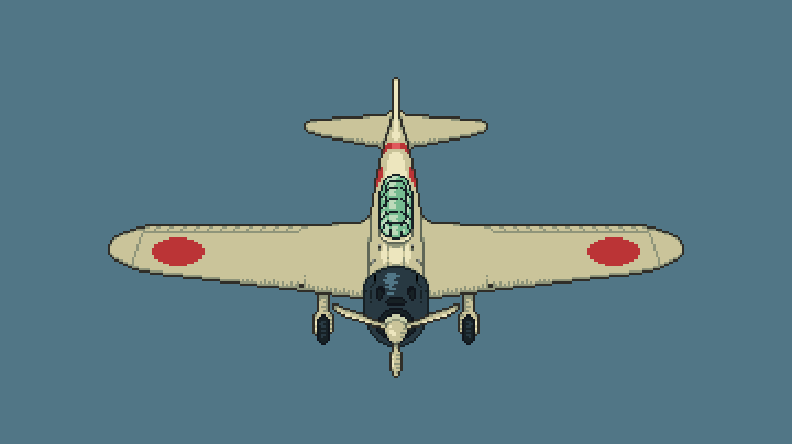

# Mesh

The **Mesh** and its corresponding **Mesh** define the 3D environment and other objects, which means that they are one of the most important details of a project.

---
## Markup

Since the meshes will be used exclusively for collisions, we don't need a lot of modeling. The question is, how do we size the model based on 2D sprites? The solution is “markup”.

The basic 3D block is 1x1x1 meter and this corresponds to two 2D tiles in orthographic projection (for lack of perspective):


!!!note
	The size of the tiles is NOT IMPORTANT. In this case it is 16x16 one tile (top is light). You can use 32x32, 48x48, 64x64, etc, which will also correspond to a 1x1x1 meter block.

Needless to say, your game will not have orthographic projection, instead you will probably use normal perspective. Nevertheless, this is important from a technical point of view, and the tiles themselves can be drawn however you like.

---
### Constructor

Let's consider a simple case where you can build meshes for objects as a constructor:


!!!note
	You will do something similar in the editor, when you will build a three-dimensional environment from individual tiles and attached to them elements of the mesha library.

---
### Proportion

For particularly complex objects, the constructor method doesn't always work.

So you have a base tile of your chosen size (16x16 for example), which refers to a 1x1x1 meter block. This is how the proportion is formed:

```
16 -> 1 meter

16 -> 1 meter
```

Now we need to calculate pixel by pixel the size of some element, taking into account the orthogonal projection. In other words, the width and height of the front and top:


Following the proportion, we calculate the required size in meters for each axis:

For the X axis:

```
16 -> 1 meter

27 -> X meter

X = (27*1)/16 = 1.6875
```

For the Y axis:

```
16 -> 1 meter

15 -> Y meter

Y = (15*1)/16 = 0.9375
```

For the Z axis:

```
16 -> 1 meter

15 -> Z meter

Z = (15*1)/16 = 0.9375
```

Now create a model based on the data you have obtained:


---
### Image

There is also a simpler alternative to proportions - using the sprites themselves.
The idea is to create a model based on an already drawn sprite, and then scale it to the desired size.

For example, this is how I made Mitsubishi Zero:




---
### Export
### MeshLibrary

For the meshes library, you have room for implementation - use the formats you are most comfortable with.

For this example, I'll start with blender itself, where we'll create the meshes. To do this, you just need to add new geometry and edit its vertices - it's pretty simple. You should end up with a structure like this:


---

Now let's move on to exporting. Choose any format that suits you; for example, I am using the **.blend** format and **.glb** as a similar alternative.

1. Add `-col` to the name of each mesh object.


2. Export the mesh in a format that is convenient for you
3. Create a **new inherited scene** by right-clicking on the exported file in Godot
4. In the open scene, go to the **“Scene”** section and export it as a **“Mesh Library”**

!!!tip
	The center of the blocks must match the center of the space in the editor

---
### OBJ

We will use the OBJ format for objects, as it is most suitable for our purposes.

1. Create a mesh.
2. Export it to the **.obj** format.
3. In the Godot editor, add **MeshInstance3D** to the scene.
4. Hold down the imported OBJ mesh and drag it into **MeshInstance3D**.

After that, generate the grid as shown in the previous section and place these two objects in the core.

!!!tip
	The center of the object must coincide with the center of the space in the editor. In Godot, the mesh will be attached to the center of the object, and you can raise the object itself to the desired height in the “Transform” section.