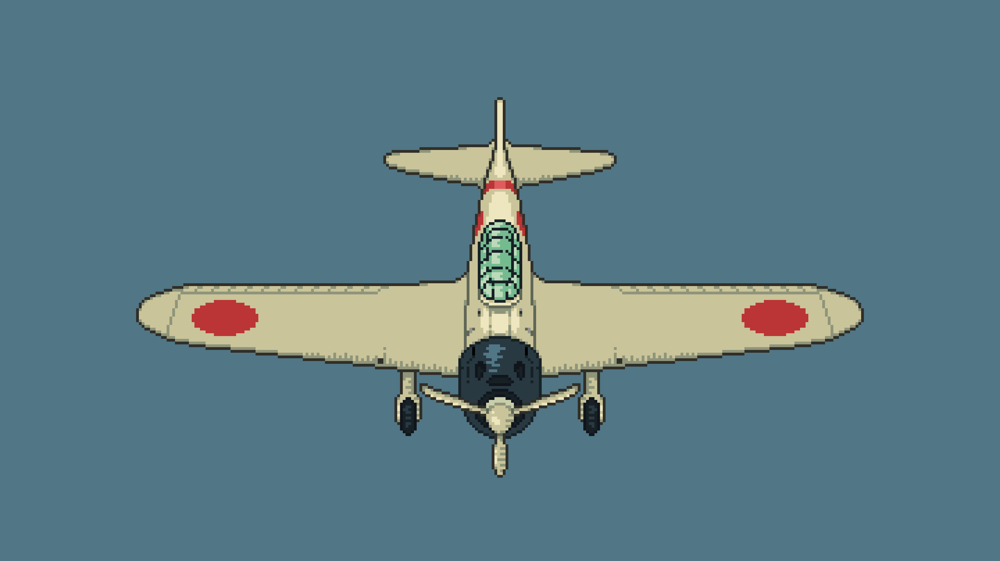

# 3D-Меши и MeshLibrary

В Daicon трехмерный **меш** и физическая **сетка коллизий** определяют геометрию мира и форму объектов.

Поскольку меши в первую очередь используются для физики и столкновений, вам не нужно заниматься сложным высокополигональным моделированием. Главная задача — правильно рассчитать габариты 3D-модели на основе ваших 2D-спрайтов.

---

## 1. Разметка и базовая пропорция

Базовый трехмерный блок имеет размер **1×1×1 метр**. В наклонной 2.5D-проекции такому кубу соответствуют **два 2D-тайла** (верхняя грань и передняя стенка):

> [!NOTE] Размер тайла
> Фактический размер тайла в пикселях может быть любым: 16×16, 32×32, 48×48, 64×64 и т.д. В формулах он задается параметром `tile_size` сущности (по умолчанию 16 пикселей = 1 метр).

---

### Метод 1: Конструктор (Блочная сборка)

Для простых объектов (стен, ящиков, ступеней) меш собирается как конструктор из элементарных метровых кубов:

> [!INFO]
> Точно таким же блочным способом вы будете рисовать уровни в редакторе Godot с помощью `DaiconMap`.

---

### Метод 2: Математический расчет по пикселям

Для объектов сложной формы (мебель, постройки с наклоном) размеры высчитываются попиксельно через простую пропорцию.

Если базовый тайл равен 16×16 пикселей (= 1 метр), считаем размеры передней и верхней части спрайта:

**Расчет размеров в метрах для каждой оси:**

* **Ось X (Ширина):**
  $$\text{X} = \frac{27 \text{ px} \times 1 \text{ м}}{16 \text{ px}} = 1.6875 \text{ м}$$
* **Ось Y (Высота):**
  $$\text{Y} = \frac{15 \text{ px} \times 1 \text{ м}}{16 \text{ px}} = 0.9375 \text{ м}$$
* **Ось Z (Глубина):**
  $$\text{Z} = \frac{15 \text{ px} \times 1 \text{ м}}{16 \text{ px}} = 0.9375 \text{ м}$$

Создаем модель в 3D-редакторе (например, Blender) по полученным размерам:

---

### Метод 3: Моделирование по спрайту

Для органических объектов или техники можно использовать готовый спрайт как фоновое изображение (Reference) в Blender: смоделировать контур прямо поверх текстуры, а затем отмасштабировать модель под нужный размер.

Пример создания модели для истребителя Mitsubishi Zero:

---

## 2. Экспорт MeshLibrary (Для тайлсетов)

Для создания карты окружения в `DaiconMap` вам понадобится библиотека мешей **`MeshLibrary`**.

### Подготовка в Blender:

1. Создайте набор нужных блоков (кубы, скосы, угловые элементы).
2. Расположите каждый меш в центре координат своего блока.

3. **Суффикс коллизий:** Добавьте `-col` в конец названия каждого объекта в Blender (например, `Wall-col`, `Slope-col`). Godot автоматически сгенерирует для них статические коллизии при импорте.

### Экспорт в Godot:

1. Экспортируйте сцену из Blender в формат **`.blend`** или **`.glb`**.
2. В Godot нажмите правой кнопкой мыши по импортированному файлу → **«Новая унаследованная сцена»**.
3. В открытой сцене перейдите в верхнее меню: **Сцена** → **Экспорт как...** → **Библиотека сеток (MeshLibrary)** (`.tres` или `.res`).
4. Назначьте созданный файл библиотеки в параметр `mesh_library` вашего `DaiconMap`.

> [!TIP] Точка привязки (Origin)
> Центр блоков в Blender должен строго совпадать с началом координат `(0, 0, 0)`.

---

## 3. Экспорт отдельных моделей (OBJ)

Для одиночных интерактивных объектов (ящиков, бочек, транспорта) удобно использовать формат **OBJ**:

1. Создайте меш объекта в 3D-редакторе.
2. Экспортируйте его в формат `.obj`.
3. В Godot добавьте в сцену узел `MeshInstance3D` и перетащите в него импортированный `.obj` файл.
4. Назначьте полученный `MeshInstance3D` в слот **Mesh Node** соответствующей Daicon-сущности.

