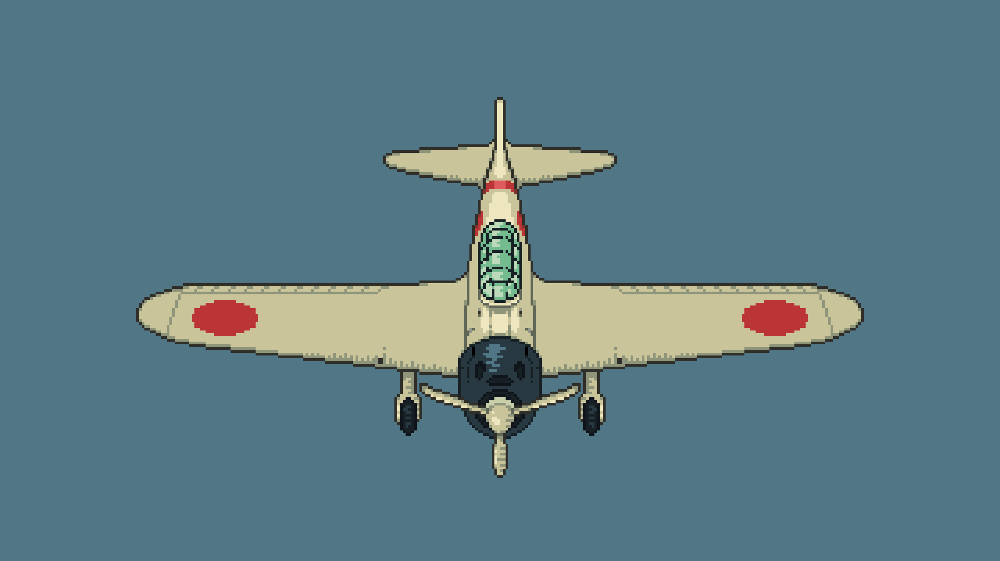

# Mesh

**Меш** и соответствующая ему **сетка** определяют 3D окружение и другие обьекты из чего следует, что они являются одной из важнейших деталей проекта.

---
## Разметка

Поскольку меш будет использоваться исключительно для столкновений, нам не требуется большая проработка моделей. Вопрос в том, как определить размеры модели базируясь на двумерных спрайтах? Решением есть "разметка".

Базовый трехмерный блок имеет размер 1x1x1 метр и это соответствует двум двумерным тайлам в ортографической проекции (за отсутствия перспективы):


!!!note
	Размер тайлов НЕ ВАЖЕН. В данном случае это 16x16 один тайл (верхушка светлая). Можно использовать 32x32, 48x48, 64x64 и тд, что также будет соответствовать блоку 1x1x1 метр.

Само собой, в вашей игры не будет ортографической проекции, вместо этого вы, вероятно, будете использовать обычную перспективу. Тем не менее это важно с технической точки зрения, а сами тайлы можно нарисовать как угодно.

---
### Конструктор

Рассмотрим простой вариант, когда вы можете строить меш для обьектов как конструктор:


!!!note
	Что-то подобное вы будете делать уже в редакторе, когда из отдельных тайлов и прикрепленным к ним элементам библиотеки меша, вы будете выстраивать трехмерное окружение.

---
### Пропорция

Для особенно сложных обьектов метод конструктора не всегда сработает.

Итак, у вас есть базовый тайл выбранного вами размера (для примера 16x16), который относиться к блоку 1x1x1 метр. Таким образом образуется пропорция:

```
16 -> 1 метр

16 -> 1 метр
```

Теперь нужно высчитать попиксельно размер какого-то елемента, учитывая ортогональную проекцию. Другими словами ширину и высоту передней части и верхушки:


За пропорцией высчитаем нужный размер в метрах для каждой оси:

Для оси X:

```
16 -> 1 метр

27 -> X метр

X = (27*1)/16 = 1.6875
```

Для оси Y:

```
16 -> 1 метр

15 -> Y метр

Y = (15*1)/16 = 0.9375
```

Для оси Z:

```
16 -> 1 метр

15 -> Z метр

Z = (15*1)/16 = 0.9375
```

Теперь создайте модель на основе полученных данных:


---
### Изображение

Есть также более простая альтернатива пропорциям - использование самих спрайтов.
Идея в том, чтобы на основе уже нарисованного спрайта создать модель, а потом масштабировать её до нужного размера.

К примеру так я сделал Mitsubishi Zero:




---
## Экспорт
### MeshLibrary

Для библиотеки меша у вас есть простор реализации - используйте те форматы, которые вам наиболее удобны.

Для примера я начну с самого блендера, где мы создадим меш. Для этого вам достаточно просто добавлять новую геометрию и редактировать её вершины - все довольно просто. По итогу у вас должна получиться такая структура:


---

Теперь перейдем к экспорту. Выбирайте любой удобный для вас формат, а для примера я использую формат **.blend** или **.glb**:

1. Кликнув правой кнопкой мыши по импортированному файлу, нажмите на пункт "Новая унаследованная сцена"
2. Выделите все блоки **MeshInstance3D** и вверху экрана нажмите на кнопку "Сетка" и создайте форму столкновений.
3. Теперь для каждого блока **MeshInstance3D** создайте **StaticBody3D** и перекиньте туда сетку коллизий.

Всё готово! Теперь просто экспортируйте библиотеку меша, нажав на раздел "Сцена", и в пункте "Экспортировать как" выберите "Библиотека сеток".

!!!tip
	Центр блоков должен совпадать с центром пространства в редакторе

---
### OBJ

Для обьектов будем использовать формат OBJ, так как он подходит для наших целей больше всего.

1. Создайте меш.
2. Экспортируйте его в формат **.obj**
3. В редакторе Godot добавьте на сцену **MeshInstance3D**.
4. Зажав импортированный меш OBJ, перекиньте его в **MeshInstance3D**.

После этого, сгенерируйте сетку, как было показано в прошлом заголовке, и поместите эти два обьекта в ядро.

!!!tip
	Нижняя часть блоков должна совпадать с горизонтальной плоскостью пространства в редакторе. В дальнейшем вы конечно сможете менять позицию меша, но это вопрос удобства и экономии времени