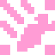

# AnimatedDaicon



**AnimatedDaicon** — 移動プラットフォーム、エレベーター、開閉扉、トラップなど、アニメーションする動的オブジェクト用のノードです。

内部で **`AnimatableBody3D`** コアを動作させます。指定された軌道に沿って移動し（`AnimationPlayer`、`Tween`、コード等）、物理のガタつきなくキャラクターを運んだり押し出したりできます。

---

## 特徴

* **物理同期 (`sync_to_physics_3d`):** アニメーションの動きを物理エンジンのティックと完全同期させます。プラットフォームに乗っているキャラクターが滑り落ちることなく滑らかに追従します。
* **コンベア速度:** `constant_linear_velocity_3d` を指定して動く歩道やエスカレーターを簡単に作成できます。

---

## スクリプト / Tween での移動例

コードでプラットフォームを制御する場合は、`AnimatedDaicon` テンプレートを使用します：

```gdscript
@tool
extends AnimatedDaicon

func _ready() -> void:
    super._ready()
    if not Engine.is_editor_hint():
        # 例: 単純な往復移動プラットフォーム
        var body := core as AnimatableBody3D
        var tween := create_tween().set_loops()
        tween.tween_property(body, "position:x", body.position.x + 3.0, 2.0)
        tween.tween_property(body, "position:x", body.position.x, 2.0)
```