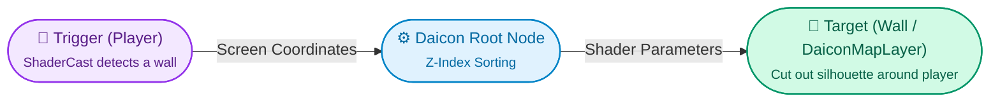

# Daicon (Shader Root Node)


**Daicon** — is the scene's root node responsible for global 2.5D sorting (`y_sort`) and the silhouette reveal system (x-ray / behind-wall shaders).

In 2.5D games, characters frequently get obscured behind tall walls or multi-level buildings. The `Daicon` node acts as a bridge between entities and environment obstacles: it tracks the precise screen coordinates of hidden characters and feeds them into the obstacle material shaders in real time.

---

## Architecture: Triggers & Targets

The system functions as a centralized dispatcher between two node groups:

* **Triggers (`shader_trigger_nodes`):** Your player characters or important interactive objects. The node inspects their `shader_cast` ray (a RayCast3D pointing toward the camera/forward). When the ray collides with an obstacle directly in front of the entity, the trigger fires.
* **Targets (`shader_target_nodes`):** Walls, roofs, and `DaiconMapLayer` tile layers equipped with a silhouette shader material that should become translucent around the obscured character.


```mermaid
graph LR
    A(["🎯 Trigger (Player)<br><small>ShaderCast detects a wall</small>"]) -->|"Screen Coordinates"| B(["⚙️ Daicon Root Node<br><small>Z-Index Sorting</small>"])
    B -->|"Shader Parameters"| C(["🧱 Target (Wall / DaiconMapLayer)<br><small>Cut out silhouette around player</small>"])

    classDef purple fill:#f3e8ff,stroke:#9333ea,stroke-width:1.5px,color:#581c87;
    classDef blue fill:#e0f2fe,stroke:#0284c7,stroke-width:1.5px,color:#0369a1;
    classDef emerald fill:#d1fae5,stroke:#059669,stroke-width:1.5px,color:#065f46;

    class A purple;
    class B blue;
    class C emerald;
```

---

## The Separation: Base Class vs Template

In Daicon's architecture, shader handling is deliberately split into two layers:

1. **Base Class `Daicon` (Plugin Engine):** Ultra-lightweight, sets `y_sort_enabled = true` and stores the lists of triggers and targets.
2. **Script Template (`script_templates/Daicon/default.gd`):** Contains the actual frame-by-frame update loop for `_physics_process`.

> [!TIP] Why this separation?
> The script template is generated directly inside your project folder when you extend the node script. You get production-ready code out of the box, yet you're free to customize how shader parameters are packed (add custom cutout radii, color tints, or multi-character masks) without ever touching the core addon code.

---

## Under the Hood

When extending `Daicon` using the default template, the following process loop runs each physics tick:

```gdscript
func _physics_process(_delta: float) -> void:
    # 1. Sort both lists by Z-Index height
    shader_target_nodes.sort_custom(func(a, b): return a.z_index < b.z_index)
    shader_trigger_nodes.sort_custom(func(a, b): return a.z_index < b.z_index)
    
    for shader_target in shader_target_nodes:
        if not is_instance_valid(shader_target): continue
        var mat := shader_target.material as ShaderMaterial
        if not mat: continue
        
        position_array.clear()
        
        # 2. Locate all characters hidden behind this specific obstacle
        for shader_trigger in shader_trigger_nodes:
            var cast = shader_trigger.shader_cast
            if cast and cast.is_colliding() and shader_target.z_index >= shader_trigger.z_index:
                # Capture precise screen coordinates for FRAGCOORD shader calculations
                var screen_pos: Vector2 = shader_trigger.get_global_transform_with_canvas().origin
                position_array.append(screen_pos)
        
        # 3. Pass coordinate arrays to the obstacle layer shader
        mat.set_shader_parameter("CircleCentres", position_array)
        mat.set_shader_parameter("NumCircleCentres", position_array.size())
```

---

## Quick Setup

1. Add a **Daicon** node as the root of your scene.
2. Extend its script, selecting the default `Daicon` template.
3. In the Inspector, assign your obstacle layers to **Shader Target Nodes** and your characters to **Shader Trigger Nodes**.
4. Attach one of the silhouette shader materials from `addons/daicon/shaders/` to your target layers.