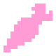

# Daicon



**Daicon** is the root node of the scene responsible for shaders.

---
## **Parameters**:

### - *shader_trigger_nodes*
<p style="color:#ffb0e0;">Array[Node]</p>
List of trigger nodes using **ShaderCast** or other shader design mechanisms on target nodes.

!!!note
	Trigger node must necessarily contain ShaderCast or other shader design mechanism. Otherwise there will be an error.

---
### - *shader_target_nodes*
<p style="color:#ffb0e0;">Array[Node]</p>
List of target nodes. Draws the shader using the passed position information from the trigger nodes.

---
### - *PositionArray*
<p style="color:#ffb0e0;">Array[Vector2]</p>
Dynamically updated list of positions of all shaders on the screen.

---
## **Methods**:

### - *_physics_process*

```java
func _physics_process(delta: float) -> void:
(1) shader_target_nodes.sort_custom(func(a, b): return a.z_index < b.z_index)
	for shader_target in shader_target_nodes:
	(2) PositionArray.clear()
	(3) shader_trigger_nodes.sort_custom(func(a, b): return a.z_index < b.z_index)
		for shader_trigger in shader_trigger_nodes:
		(4) if shader_trigger.shader_cast.is_colliding() and shader_target.z_index >= shader_trigger.z_index:
			(5) PositionArray.append(get_viewport().get_final_transform() * shader_trigger.get_global_transform_with_canvas() * Vector2(0,0))
	(6) shader_target.material.set_shader_parameter("CircleCentres", PositionArray)
		shader_target.material.set_shader_parameter("NumCircleCentres", PositionArray.size())
```

1. Sorting the list of target nodes by z-index.
2. clearing the list of items.
3. Sorting the list of triggers by z-index
4. Checking: whether ShaderCast is active and if the z-index of the target is higher behind the z-index of the trigger
5. Put the coordinates of the trigger into the list of positions
6. Enter the coordinates into the shader parameter

---
### - *_ready*

```java
func _ready() -> void:
	self.set_y_sort_enabled(true)
```

The **set_y_sort_enabled** parameter is always **true**.