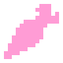

# Daicon



**Daicon** は、シェーダーを担当するシーンのルートノードです。

---
## **パラメータ**:

### - *shader_trigger_nodes*
<p style="color:#ffb0e0;">Array[Node]</p>
ターゲットノード上で **ShaderCast** または他のシェーダ設計メカニズムを使用するトリガノードのリスト。

!!!note
	トリガーノードには、必ず ShaderCast または他のシェーダー設計メカニズムが含まれていなければなりません。そうでなければエラーとなる。
	
---
### - *shader_target_nodes*
<p style="color:#ffb0e0;">Array[Node]</p>
ターゲットノードのリスト。トリガノードから送信された位置情報を使用してシェーダを描画します。

---
### - *PositionArray*
<p style="color:#ffb0e0;">Array[Vector2]</p>
画面上のすべてのシェーダーの位置のリストを動的に更新する。

---
## **方法**:

### - *_physics_process*

```java
func _physics_process(delta: float) -> void:
(1) shader_target_nodes.sort_custom(func(a, b): return a.z_index < b.z_index)
	for shader_target in shader_target_nodes:
	(2) PositionArray.clear()
	(3) shader_trigger_nodes.sort_custom(func(a, b): return a.z_index < b.z_index)
		for shader_trigger in shader_trigger_nodes:
		(4) if shader_trigger.shader_cast.is_colliding() and shader_target.z_index >= shader_trigger.z_index:
			(5) PositionArray.append(get_viewport().get_final_transform() * shader_trigger.get_global_transform_with_canvas() * Vector2(0,0))
	(6) shader_target.material.set_shader_parameter("CircleCentres", PositionArray)
		shader_target.material.set_shader_parameter("NumCircleCentres", PositionArray.size())
```

1. 対象ノードのリストをzインデックスでソートする。
2. 項目のリストをクリアする。
3. トリガーのリストを z-index でソートする
4. ShaderCast がアクティブかどうか、およびターゲットの z-index がトリガーの z-index よりも高いかどうかをチェックする
5. トリガーの座標を位置のリストに入れる
6. シェーダーパラメータに座標を入力する

---
### - *_ready*

```java
func _ready() -> void:
	self.set_y_sort_enabled(true)
```

set_y_sort_enabled**パラメータは常に**true**である。