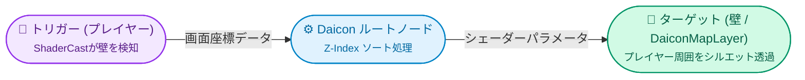

# Daicon (シェーダールートノード)


**Daicon** — グローバルな2.5Dソート（`y_sort`）と遮蔽物のシルエット透過システム（X線・壁裏透過シェーダー）を統括するシーンのルートノードです。

2.5Dゲームでは、高い壁や多層構造の建物の後ろにキャラクターが隠れてしまうことが頻繁にあります。`Daicon` ノードはエンティティと障害物の架け橋となり、壁に隠れたキャラクターの正確な画面座標を取得して、環境マテリアルのシェーダーへリアルタイムに渡します。

---

## アーキテクチャ: トリガーとターゲット

このシステムは、2つのノードグループ間を繋ぐ中央ディスパッチャーとして機能します：

* **トリガー (`shader_trigger_nodes`):** プレイヤーや重要なインタラクティブオブジェクト。ノードは各エンティティの `shader_cast`（カメラ方向／前方へ向けられたRayCast3D）を監視します。光線が前方の障害物に当たると、トリガーが有効化されます。
* **ターゲット (`shader_target_nodes`):** キャラクターの背後に入った際に半透明化させたい壁、屋根、および `DaiconMapLayer` タイル層（シルエットシェーダーマテリアル適用済み）。


```mermaid
graph LR
    A(["🎯 トリガー (プレイヤー)<br><small>ShaderCastが壁を検知</small>"]) -->|"画面座標データ"| B(["⚙️ Daicon ルートノード<br><small>Z-Index ソート処理</small>"])
    B -->|"シェーダーパラメータ"| C(["🧱 ターゲット (壁 / DaiconMapLayer)<br><small>プレイヤー周囲をシルエット透過</small>"])

    classDef purple fill:#f3e8ff,stroke:#9333ea,stroke-width:1.5px,color:#581c87;
    classDef blue fill:#e0f2fe,stroke:#0284c7,stroke-width:1.5px,color:#0369a1;
    classDef emerald fill:#d1fae5,stroke:#059669,stroke-width:1.5px,color:#065f46;

    class A purple;
    class B blue;
    class C emerald;
```

---

## 構造の分離: 基本クラスとテンプレート

Daiconの設計では、シェーダー処理ロジックが意図的に2層へ分離されています：

1. **基本クラス `Daicon` (プラグインのコア):** 軽量設計で、`y_sort_enabled = true` を有効化し、トリガーとターゲットのリストを保持します。
2. **スクリプトテンプレート (`script_templates/Daicon/default.gd`):** `_physics_process` における実際の毎フレーム更新ロジックを含みます。

> [!TIP] なぜ分離されているのか？
> ノードのスクリプトを拡張する際、テンプレートがプロジェクト内に直接生成されます。導入後すぐに動く完成コードが手に入るだけでなく、アドオン本体に手を加えることなく、独自のシェーダーパラメータ（透過半径、カラー、マスク等）に合わせて自由にカスタマイズ可能です。

---

## 実際のコード処理

デフォルトテンプレートを使用して `Daicon` スクリプトを拡張すると、内部で以下のループ処理が実行されます：

```gdscript
func _physics_process(_delta: float) -> void:
    # 1. Z-Indexの高さ順に両リストをソート
    shader_target_nodes.sort_custom(func(a, b): return a.z_index < b.z_index)
    shader_trigger_nodes.sort_custom(func(a, b): return a.z_index < b.z_index)
    
    for shader_target in shader_target_nodes:
        if not is_instance_valid(shader_target): continue
        var mat := shader_target.material as ShaderMaterial
        if not mat: continue
        
        position_array.clear()
        
        # 2. 壁の後ろに隠れているキャラクターを特定
        for shader_trigger in shader_trigger_nodes:
            var cast = shader_trigger.shader_cast
            if cast and cast.is_colliding() and shader_target.z_index >= shader_trigger.z_index:
                # FRAGCOORD シェーダー計算用の正確な画面座標を取得
                var screen_pos: Vector2 = shader_trigger.get_global_transform_with_canvas().origin
                position_array.append(screen_pos)
        
        # 3. 障害物レイヤーのシェーダーへ座標配列を送信
        mat.set_shader_parameter("CircleCentres", position_array)
        mat.set_shader_parameter("NumCircleCentres", position_array.size())
```

---

## クイックスタート

1. シーンのルートに **Daicon** ノードを追加します。
2. ノードのスクリプトを拡張し、`Daicon` テンプレートを選択します。
3. インスペクタで、障害物レイヤーを **Shader Target Nodes** に、プレイヤーを **Shader Trigger Nodes** に登録します。
4. `addons/daicon/shaders/` フォルダ内の透過シェーダーマテリアルをターゲットレイヤーに設定します。