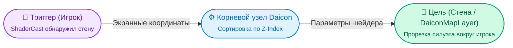

# Daicon (Корневой узел шейдеров)


**Daicon** — это корневой узел сцены, отвечающий за глобальную 2.5D-сортировку (`y_sort`) и систему просвечивания объектов сквозь стены (силуэтные шейдеры).

В 2.5D играх персонаж часто скрывается за высокими стенами или постройками. Нода `Daicon` связывает сущности с препятствиями: собирает точные экранные координаты персонажей, скрытых за стенами, и передает их в шейдеры материалов окружения.

---

## Архитектура: Триггеры и Цели

Система работает как централизованный диспетчер между двумя группами узлов:

* **Триггеры (`shader_trigger_nodes`):** Ваши персонажи или важные объекты. Нода проверяет их луч `shader_cast` (RayCast3D, направленный в камеру/вперед). Если луч упирается в препятствие перед объектом — триггер активируется.
* **Цели (`shader_target_nodes`):** Стены, крыши и тайловые слои `DaiconMapLayer` с шейдерным материалом, которые должны стать полупрозрачными в месте нахождения персонажа.



---

## Разделение: Базовый класс и Шаблон

В архитектуре Daicon логика шейдеров намеренно разделена на две части:

1. **Базовый класс `Daicon` (движок аддона):** Максимально легкий, включает `y_sort_enabled = true` и хранит списки триггеров и целей.
2. **Скрипт-шаблон (`script_templates/Daicon/default.gd`):** Содержит готовую логику обновления для `_physics_process`.

> [!TIP] Зачем это сделано?
> Шаблон генерируется прямо в вашем проекте при расширении скрипта ноды. Вы получаете полностью рабочий код из коробки, но можете свободно переписать логику передачи шейдерных параметров под свои уникальные шейдеры (добавить радиусы, цвета, маски), не ломая плагин.

---

## Как это работает в коде

Когда вы расширяете скрипт от `Daicon` с шаблоном по умолчанию, под капотом выполняется следующий цикл:

```gdscript
func _physics_process(_delta: float) -> void:
    # 1. Сортируем списки по высоте Z-Index
    shader_target_nodes.sort_custom(func(a, b): return a.z_index < b.z_index)
    shader_trigger_nodes.sort_custom(func(a, b): return a.z_index < b.z_index)
    
    for shader_target in shader_target_nodes:
        if not is_instance_valid(shader_target): continue
        var mat := shader_target.material as ShaderMaterial
        if not mat: continue
        
        position_array.clear()
        
        # 2. Ищем персонажей, скрытых за стеной
        for shader_trigger in shader_trigger_nodes:
            var cast = shader_trigger.shader_cast
            if cast and cast.is_colliding() and shader_target.z_index >= shader_trigger.z_index:
                # Получаем точные экранные координаты для FRAGCOORD шейдера
                var screen_pos: Vector2 = shader_trigger.get_global_transform_with_canvas().origin
                position_array.append(screen_pos)
        
        # 3. Передаем массив точек в шейдер конкретного слоя
        mat.set_shader_parameter("CircleCentres", position_array)
        mat.set_shader_parameter("NumCircleCentres", position_array.size())
```

---

## Быстрый запуск

1. Добавьте узел **Daicon** в корень вашей сцены.
2. Расширьте его скрипт, выбрав шаблон `Daicon`.
3. В инспекторе добавьте стены в список **Shader Target Nodes**, а игрока — в **Shader Trigger Nodes**.
4. Назначьте на стены шейдерный материал из папки `addons/daicon/shaders/`.