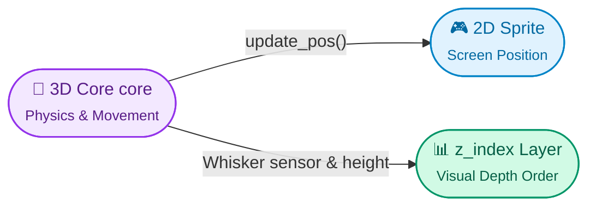

# DaiconEntity (Base Entity)

**DaiconEntity** — is the foundational class for all physical 2.5D objects in Daicon. It fuses a 2D node (`Node2D`) and a 3D physical body (`core`), seamlessly synchronizing their movement, transformation, and depth sorting.

You don't usually add `DaiconEntity` directly into your scenes — instead, you use its specialized child classes:
* **`KinematicDaicon`** — for dynamic bodies and controllable characters (`CharacterBody3D`).
* **`RigidDaicon`** — for physics-driven objects with mass and impulses (`RigidBody3D`).
* **`StaticDaicon`** — for immovable objects and static obstacles (`StaticBody3D`).
* **`AnimatedDaicon`** — for moving platforms, doors, and elevators (`AnimatableBody3D`).

---

## 2.5D Projection & Synchronization

The main magic of `DaiconEntity` is the automatic translation between 2D screen pixels and 3D meters in physical space:

### Key Projection Properties:

* **Tile Size (`tile_size: int`):** How many screen pixels equal 1 meter in 3D (default is 16).
* **Y 3D (`y_3d: float`):** Vertical height of the entity along the 3D world's Y axis.
* **Offset 3D (`offset_3d: Vector3`):** Center offset of the 3D core relative to the 2D sprite origin (default `(0, 0.5, 0)`, placing feet at zero).
* **Z Step (`z_step: int`):** The `z_index` step between spatial elevation levels (default is 10).
* **Z Sort Coef (`z_sort_coef: float`):** Height coefficient of the object itself to correctly sort behind/in front of nearby obstacles.

---

## Dynamic Z-Index & Whisker Sensor

To ensure 2D sprites properly overlap depending on who is standing higher or hiding behind a wall, call **`update_pos()`**:

1. **When no obstacles overlap:** The `z_index` layer is calculated directly from the object's 3D height:
   $$\text{z\_index} = (\text{Y}_{3D} + \text{z\_sort\_coef}) \times \text{z\_step} + 2$$
2. **When passing behind an obstacle:** The `whisker` sensor (`Area3D` inside the core) detects the wall collision. If the obstacle has a `z_index` metadata tag, the entity automatically renders behind it (`z_index = wall.z_index - 1`).

> [!TIP] When to call `update_pos()`?
> Call `update_pos()` inside your character's `_physics_process()` right after `move_and_slide()` — this guarantees instant, buttery-smooth sprite sync with the physical core.

---

## 3D Transform Controls

The inspector provides flexible rotation modes under the **Transform 3D** group:
* **Euler** — standard rotation angles in degrees/radians (`rotation_3d`).
* **Quaternion** — gimbal-lock-free orientation (`quaternion_3d`).
* **Basis** — 3x3 matrix representation (`basis_3d`).

Switching `rotation_edit_mode_3d` automatically hides inactive fields in the inspector to keep the UI clean.

---

## Core Slots

Every entity comes with 5 dedicated slots to assemble its 3D body (detailed in the [[core.en|Core Manual]]):

* **Mesh Node:** 3D model for visuals or debugging.
* **Shape Node:** Primary physics collision shape.
* **Whisker Node & Whisker Shape:** Obstacle occlusion sensor.
* **Shader Cast Node:** Raycast probe for silhouette reveal shaders.