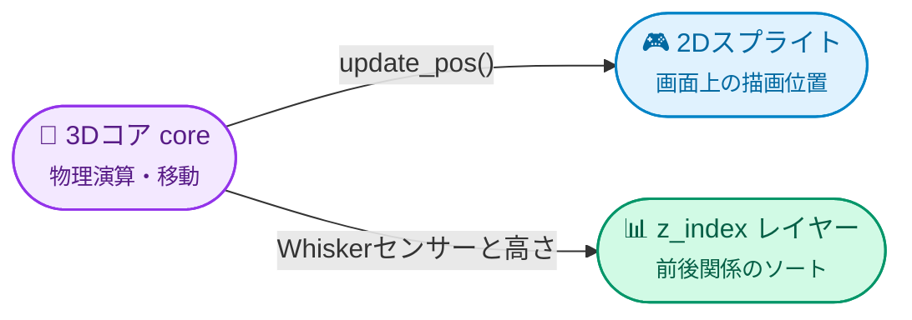

# DaiconEntity (基本エンティティ)

**DaiconEntity** — Daiconにおけるすべての2.5D物理オブジェクトの基底クラスです。2Dノード（`Node2D`）と3D物理ボディ（`core`）を融合させ、移動、トランスフォーム、深度ソートをリアルタイムに同期します。

通常、`DaiconEntity` を直接シーンに配置することはなく、用途に応じた専用の派生ノードを使用します：
* **`KinematicDaicon`** — 操作キャラクターや動的オブジェクト用（`CharacterBody3D`）。
* **`RigidDaicon`** — 質量や衝撃を持つ物理挙動オブジェクト用（`RigidBody3D`）。
* **`StaticDaicon`** — 静止した障害物や壁用（`StaticBody3D`）。
* **`AnimatedDaicon`** — 移動プラットフォーム、扉、エレベーター用（`AnimatableBody3D`）。

---

## 2.5D 投影と同期

`DaiconEntity` の最大の強みは、画面上の2Dピクセルと物理空間の3Dメーターを自動変換する同期システムです：

### 主な投影パラメータ:

* **Tile Size (`tile_size: int`):** 3D空間の1メートルに相当する画面ピクセル数（デフォルトは16）。
* **Y 3D (`y_3d: float`):** 3Dワールドの垂直軸（Y軸）における高さ。
* **Offset 3D (`offset_3d: Vector3`):** 2Dスプライト原点に対する3Dコアのオフセット（デフォルトは `(0, 0.5, 0)`、足元が原点になります）。
* **Z Step (`z_step: int`):** 高さレベル（フロア）ごとの `z_index` のステップ幅（デフォルトは10）。
* **Z Sort Coef (`z_sort_coef: float`):** 障害物との前後関係を正しく判定するためのオブジェクト自身の高さ係数。

---

## 動的 Z-Index と Whisker センサー

高低差や壁の遮蔽に応じて2Dスプライトが正しく重なり合うよう、**`update_pos()`** を呼び出します：

1. **遮蔽物がない場合:** `z_index` はオブジェクトの3Dの高さから直接計算されます：
   $$\text{z\_index} = (\text{Y}_{3D} + \text{z\_sort\_coef}) \times \text{z\_step} + 2$$
2. **障害物の後ろに入った場合:** コア内の `whisker` センサー（`Area3D`）が壁の衝突を検知します。壁に `z_index` のメタデータがある場合、エンティティは自動的にその背後へソートされます（`z_index = wall.z_index - 1`）。

> [!TIP] `update_pos()` を呼び出すタイミング
> キャラクターの `_physics_process()` 内で `move_and_slide()` を実行した直後に `update_pos()` を呼び出してください。スプライトが3Dコアの物理位置と遅延なく滑らかに同期します。

---

## 3D トランスフォーム制御

インスペクタの **Transform 3D** グループで、回転モードを柔軟に切り替え可能です：
* **Euler** — 度／ラジアンによる一般的な回転角（`rotation_3d`）。
* **Quaternion** — ジンバルロックのない四元数回転（`quaternion_3d`）。
* **Basis** — 3x3 行列による回転とスケール（`basis_3d`）。

`rotation_edit_mode_3d` を切り替えると、現在非アクティブな項目がインスペクタから自動的に隠され、UIがすっきり保たれます。

---

## コアスロット (Slots)

各エンティティは3Dボディを構築するための5つの専用スロットを備えています（詳細は [[core.ja|コアガイド]] を参照）：

* **Mesh Node:** ビジュアルやデバッグ用の3Dモデル。
* **Shape Node:** メインの物理衝突形状。
* **Whisker Node & Whisker Shape:** 障害物遮蔽検知センサー。
* **Shader Cast Node:** シルエット透過シェーダー用レイキャスト。