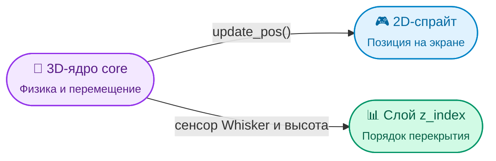

# DaiconEntity (Базовая сущность)

**DaiconEntity** — это фундаментальный класс для всех физических 2.5D-объектов в Daicon. Он объединяет 2D-ноду (`Node2D`) и трехмерное физическое тело (`core`), синхронизируя их перемещение, трансформацию и сортировку глубины.

Напрямую `DaiconEntity` в сцену обычно не добавляют — вместо неё используются готовые наследники:
* **`KinematicDaicon`** — для динамических тел (`CharacterBody3D`).
* **`RigidDaicon`** — для объектов с физикой и импульсами (`RigidBody3D`).
* **`StaticDaicon`** — для неподвижных обьектов (`StaticBody3D`).
* **`AnimatedDaicon`** — для движущихся платформ и лифтов (`AnimatableBody3D`).

---

## 2.5D Проекция и Синхронизация

Главная магия `DaiconEntity` — автоматический перевод между 2D-пикселями на экране и 3D-метрами в физическом пространстве:

### Ключевые параметры проекции:

* **Tile Size (`tile_size: int`):** Сколько экранных пикселей равны 1 метру в 3D (по умолчанию 16).
* **Y 3D (`y_3d: float`):** Высота сущности по вертикальной оси 3D-мира.
* **Offset 3D (`offset_3d: Vector3`):** Центровочное 3D-смещение ядра относительно 2D-спрайта (по умолчанию `(0, 0.5, 0)`, чтобы ноги стояли на нуле).
* **Z Step (`z_step: int`):** Шаг `z_index` между этажами/уровнями высоты (по умолчанию 10).
* **Z Sort Coef (`z_sort_coef: float`):** Коэффициент высоты самого объекта для корректного перекрытия других тел.

---

## Динамический Z-Index и Сенсор Whisker

Чтобы 2D-спрайты правильно перекрывали друг друга в зависимости от того, кто стоит выше или спрятался за стеной, вызывается метод **`update_pos()`**:

1. **Если рядом нет перекрытий:** Слой `z_index` рассчитывается строго из 3D-высоты объекта:
   $$\text{z\_index} = (\text{Y}_{3D} + \text{z\_sort\_coef}) \times \text{z\_step} + 2$$
2. **Если объект зашел за препятствие:** Сенсор `whisker` (Area3D в ядре) ловит коллизию стены. Если у стены есть метаданные `z_index`, сущность автоматически встает за ней (`z_index = wall.z_index - 1`).

> [!TIP] Когда вызывать `update_pos()`?
> Вызывайте `update_pos()` в `_physics_process()` вашего персонажа сразу после `move_and_slide()` — это гарантирует мгновенную плавную синхронизацию спрайта с физическим ядром.

---

## Управление 3D-Трансформацией

В инспекторе в группе **Transform 3D** доступны удобные режимы вращения ядра:
* **Euler** — привычные углы поворота в градусах/радианах (`rotation_3d`).
* **Quaternion** — для вращений без блокировки осей (`quaternion_3d`).
* **Basis** — матричное представление ориентации (`basis_3d`).

Переключение режима `rotation_edit_mode_3d` автоматически скрывает неактивные поля в инспекторе, чтобы не захламлять интерфейс.

---

## Слоты ядра (Slots)

Каждая сущность хранит 5 слотов для сборки 3D-тела (подробнее в [[core.ru|Руководстве по Ядру]]):

* **Mesh Node:** 3D-модель для визуала или дебага.
* **Shape Node:** Основная физическая форма коллизии.
* **Whisker Node & Whisker Shape:** Сенсор перекрытий препятствиями.
* **Shader Cast Node:** Луч проверки для силуэтных шейдеров.