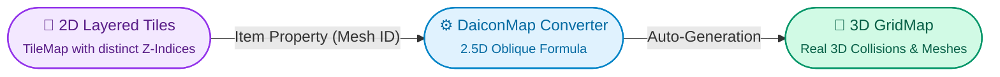

# DaiconMap

**DaiconMap** — is the primary node for building multi-layered 2.5D level environments using Godot's tile system.

You paint the level using familiar 2D tiles in the editor, and the node automatically constructs a full 3D voxel world beneath them via an internal **`GridMap`**.

---

## How It Works

1. **2D Tiles Map to 3D Meshes:** Inside the `TileSet`, each tile receives an `Item` integer custom data property (the mesh ID from your `MeshLibrary`).
2. **Tilted 2.5D Perspective:** Each layer carries its own `z_index`. When painting tiles, Daicon calculates the 3D position using the oblique projection formula:
   $$\text{3D Position} = (\text{Tile X}, \ \text{Layer Z} - 1, \ \text{Tile Y} + \text{Layer Z})$$
3. **Real-Time Editor Sync:** During level design, the map tracks tile count changes and instantly rebuilds 3D collisions and geometry.

---

## Key Settings

* **Mesh Library (`mesh_library`):** The collection of 3D block models used to construct the level (see [Mesh Library Manual](../manual/mesh.md)).
* **Cell Size (`size: Vector3`):** Size of each 3D block in meters (default `1x1x1`).
* **Z Step (`z_step: int`):** The `z_index` step between elevation tiers (default is `10`). E.g. Tier 0 = `z_index 0`, Tier 1 = `z_index 10`, Tier 2 = `z_index 20`.
* **Collision Layer & Mask:** 3D physics collision filtering against characters and rigid props.
* **Bake Navigation:** Bakes a 3D `NavigationMesh` for enemy pathfinding across the tilemap.

> [!TIP] Standalone Layer Nodes
> You can use TileMap internal layers or extract them as child `TileMapLayer` nodes under `DaiconMap` — both are automatically aggregated into the single 3D GridMap.