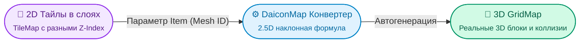

# DaiconMap

**DaiconMap** — это главный узел для создания многоуровневого 2.5D-окружения на основе системы тайлов.

Вы рисуете уровень привычными 2D-тайлами в редакторе Godot, а нода автоматически генерирует под ними настоящее трехмерное воксельное окружение через внутренний **`GridMap`**.

---

## Как это работает

1. **2D-Тайлы сопоставляются с 3D-Мешами:** В `TileSet` каждому тайлу назначается числовой параметр `Item` (ID блока в вашей библиотеке мешей `MeshLibrary`).
2. **Наклонная 2.5D-проекция:** Каждый слой тайлов имеет свой `z_index`. При размещении тайла нода автоматически рассчитывает 3D-координаты с учетом наклона перспективы:
   $$\text{Позиция в 3D} = (\text{X}_{\text{тайла}}, \ \text{Z}_{\text{слоя}} - 1, \ \text{Y}_{\text{тайла}} + \text{Z}_{\text{слоя}})$$
3. **Автоматическая синхронизация:** В редакторе карта сама следит за изменениями тайлов и мгновенно перестраивает 3D-коллизии и геометрию.

```mermaid
graph LR
    A(["🎨 2D Тайлы в слоях<br><small>TileMap с разными Z-Index</small>"]) -->|"Параметр Item (Mesh ID)"| B(["⚙️ DaiconMap Конвертер<br><small>2.5D наклонная формула</small>"])
    B -->|"Автогенерация"| C(["🧱 3D GridMap<br><small>Реальные 3D блоки и коллизии</small>"])

    classDef purple fill:#f3e8ff,stroke:#9333ea,stroke-width:1.5px,color:#581c87;
    classDef blue fill:#e0f2fe,stroke:#0284c7,stroke-width:1.5px,color:#0369a1;
    classDef emerald fill:#d1fae5,stroke:#059669,stroke-width:1.5px,color:#065f46;

    class A purple;
    class B blue;
    class C emerald;
```

---

## Настройка карты

* **Mesh Library (`mesh_library`):** Библиотека 3D-мешей, из которых собирается мир (см. [[mesh.ru|Руководство по созданию MeshLibrary]])
* **Cell Size (`size: Vector3`):** Размер одного трехмерного вокселя в метрах (по умолчанию `1x1x1`).
* **Z Step (`z_step: int`):** Шаг Z-индекса между уровнями высоты (по умолчанию `10`). Например: уровень 0 = `z_index 0`, уровень 1 = `z_index 10`, уровень 2 = `z_index 20`.
* **Collision Layer & Mask:** Физические слои 3D-мира для коллизий с персонажами и телами.
* **Bake Navigation:** Запекание навигационной 3D-сетки (`NavigationMesh`) для поиска путей мобами.

> [!TIP] Извлечение слоев
> Вы можете использовать как встроенные слои `TileMap`, так и вынести их в отдельные узлы `TileMapLayer` (дочерние к `DaiconMap`) — аддон автоматически учтет их при генерации 3D-мира.