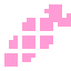

# DaiconMap



Представляет собой набор **TileMapLayers**, которые в свою очередь, являются уровнями вашего окружения.

Каждый такой слой содержит уникальный **z-индекс** являющийся показателем высоты данного слоя в пространстве. Другими словами **z-сортировка** размещает объекты по модулируемой оси **Z** на основе их индекса.

---
## **Параметры**:

### - *grid_map*
<p style="color:#ffb0e0;">GridMap</p>
Ядро DaiconMap.

---
### - *cells_count*
<p style="color:#ffb0e0;">int</p>
Количество трехмерных тайлов.

---
### - *mesh_library*
<p style="color:#ffb0e0;">MeshLibrary</p>
Библиотека меша из которого строиться 3D окружение.

---
### - *physics_material*
<p style="color:#ffb0e0;">PhysicsMaterial</p>
Используется для определения физических свойств, таких как трение и упругость, отдельных тайлов.

---
### - *z_step*
<p style="color:#ffb0e0;">int</p>
Z-шаг в системе сортировки между уровнями высоты.

Например **z_step** = 10, тогда:

Уровень -1 = -10
Уровень 0 = 0
Уровень 1 = 10
Уровень 2 = 20

---
### - *size*
<p style="color:#ffb0e0;">Vector3</p>
Размер одного трехмерного тайла в метрах.

---
### - *layer*
<p style="color:#ffb0e0;">int</p>
Слои столкновений для **grid_map**.

---
### - *mask*
<p style="color:#ffb0e0;">int</p>
Слои столкновений для **grid_map**.

---
### - *bake_navigation*
<p style="color:#ffb0e0;">bool</p>
Запечь навигационную сетку для 3D.

---
## **Методы**:
### - *_ready*

При каждом запуске развертывает ядро. Проводит базовую настройку ноды.

---
### - *_process*

> Работает только в редакторе.

Обновляет **grid_map** когда количество трехмерных тайлов не равно количеству двумерных (вызывает **update_grid_map**).

Синхронизирует перемещение ноды в 2D и её ядра в 3D. 

---
### - *get_cells*

Возвращает количество используемых трехмерных тайлов в 3D окружении.

```python
func get_cells() -> int:
	_cells_count = 0
	for layer_index in range(0, get_layers_count()):
		_cells_count += len(get_used_cells(layer_index))
	for layer in get_children():
		if layer is TileMapLayer:
			_cells_count += len(layer.get_used_cells())
	return _cells_count
```

---
### - *update_grid_map*

Обновляет **grid_map**.

```python
func update_grid_map():
	grid_map.clear()
	for layer_index in range(0, get_layers_count()):
		var z = get_layer_z_index(layer_index) / z_step
		for tile in get_used_cells(layer_index):
			var tile_data = get_cell_tile_data(layer_index, Vector2(tile.x, tile.y))
			grid_map.set_cell_item(Vector3(tile.x, z-1, tile.y+z), tile_data.get_custom_data("Item"))
	for layer in get_children():
		if layer is TileMapLayer:
			var z = layer.z_index / z_step
			for tile in layer.get_used_cells():
				var tile_data = layer.get_cell_tile_data(Vector2(tile.x, tile.y))
				grid_map.set_cell_item(Vector3(tile.x, z-1, tile.y+z), tile_data.get_custom_data("Item"))
```