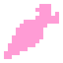

# DaiconShadow



**DaiconShadow** - нода создает тень под выбранным обьектом.

---
## **Параметры**:

### - *d3*
<p style="color:#ffb0e0;">CharacterBody3D</p>
Ядро DaiconShadow.

---
### *daicon_parent*

<p style="color:#ffb0e0;">Node</p>
Узел, к которому прикреплена тень.

---
### - *tile_size*
<p style="color:#ffb0e0;">int</p>
Размер плитки определяет, сколько пикселей соответствует 1 метру в 3D.
(по сути, это размер плитки на размер ячейки в 3D)

*Автоматически синхронизирован с **daicon_parent***

---
### - *z_step*
<p style="color:#ffb0e0;">int</p>
Z-шаг в системе сортировки между уровнями высоты.

Например **z_step** = 10, тогда:

Уровень -1 = -10
Уровень 0 = 0
Уровень 1 = 10
Уровень 2 = 20

*Автоматически синхронизирован с **daicon_parent***

---
### - *min_distance*
<p style="color:#ffb0e0;">int</p>
Минимальное расстояние для модуляции текстуры (в метрах).

- Для окрашивания оптимальное значение составляет 1 и более;
- Для обесцвечивания оптимальное значение составляет менее 1.

---
### - *max_distance*
<p style="color:#ffb0e0;">int</p>
Максимальное расстояние между родителем и собой (в метрах).

---
### *shadow_mode*

<p style="color:#ffb0e0;">int</p>
Режим модуляции тени: "Discoloration", "Coloration"

---
### *stream_mode*

<p style="color:#ffb0e0;">int</p>
Режим поведения ядра физического тела: "Logic", "Direct"

**Logic** поток проверяет состояние тела относительно поверхности (is_on_floor). **Direct** - нет.

---
### - *shape*
<p style="color:#ffb0e0;">Node3D</p>
Ячейка для шейп-ноды которая встраивается в ядро (нужна для столкновений).
Пропускает только **CollisionShape3D** или **CollisionPolygon3D**.
Имеет собственный словарь в разделе "Core": **shape_properties**.

---
### *Shape-раздел*

Cодержит параметры для  Shape.

---
### *KinematicBody3D-раздел*

Раздел параметров для корневой ноды ядра. 

`(Смотрите документацию Godot : CharacterBody3D / KinematicBody3D)`

---
### *CollisionObject3D-раздел*

Раздел параметров для корневой ноды ядра. 

`(Смотрите документацию Godot : CollisionObject3D)`

!!!info
	Также содержит **axis_lock**.

---
## **Методы**:
## - *_ready*

При каждом запуске развертывает ядро. Проводит базовую настройку ноды.

---
### - *_process*

Синхронизирует перемещение ноды в 2D и её ядра в 3D. 

Добавляет в исключение коллизии с **daicon_parent**, обновляет модуляцию тени (срабатывает единожды при запуске).

---
### - *physics_process*

Обновляет позицию ядра, обновляет z_index, рисует тень.

```python
func _physics_process(delta: float) -> void:
	if not Engine.is_editor_hint():
		if daicon_parent and daicon_parent.d3:
			var distance := d3.position.distance_to(daicon_parent.d3.global_position - daicon_parent.offset_3d)
			
			if stream_mode:
				#direct
				_update_direct_position(distance)
			elif not stream_mode:
				#logic
				_update_position(distance, delta)
```

---
### *_update_modulation*

```python
func _update_modulation(distance):
	if shadow_mode:
		#coloration
		if distance > min_distance:
			self.modulate.a = _initial_alpha
		else:
			self.modulate.a = lerp(0.0, _initial_alpha, distance / min_distance)
	elif not shadow_mode:
		#discoloration
		if distance > min_distance:
			self.modulate.a = lerp(0.0, _initial_alpha, min_distance / distance)
		else:
			self.modulate.a = _initial_alpha
```

Функция обновляет прозрачность тени.

---
### - *_update_position*

```python
func _update_position(distance, delta):
	if daicon_parent.d3.is_on_floor():
		self.visible = true
		_update_modulation(distance)
		
		self.position.y = start_y
		d3.position = daicon_parent.d3.position - daicon_parent.offset_3d
		self.z_index = (round(d3.position.y + 0.3) * z_step) + 1
	else:
		if distance < max_distance:
			d3.velocity.y -= GRAVITY * delta
		else:
			self.visible = false
			d3.position = daicon_parent.d3.position - daicon_parent.offset_3d
		
		if d3.is_on_floor():
			self.visible = true
			_update_modulation(distance)
			self.position.y = start_y + (distance * tile_size)
			self.z_index = (round(d3.position.y + 0.3) * z_step) + 1
			d3.position = daicon_parent.d3.position - daicon_parent.offset_3d
	d3.move_and_slide()
```

Функция обновляет позицию обьекта в 2D пространстве, определяет z_index ноды.
(для логического потока)

---
### - *_update_direct_position*

```python
func _update_direct_position(distance):
	if distance < max_distance:
		d3.velocity.y = -GRAVITY
	else:
		self.visible = false
		d3.position = daicon_parent.d3.position - daicon_parent.offset_3d
	
	if d3.is_on_floor():
		self.visible = true
		_update_modulation(distance)
		self.position.y = start_y + (distance * tile_size)
		self.z_index = (round(d3.position.y + 0.3) * z_step) + 1
		d3.position = daicon_parent.d3.position - daicon_parent.offset_3d
	d3.move_and_slide()
```

Функция обновляет позицию обьекта в 2D пространстве, определяет z_index ноды.
(для прямого потока)

---
### - *_expand*

```java
func _expand() -> void:
	_expand_d3()
	if shape_properties:
		_expand_shape()
```

Функция занимается развертыванием ядра.