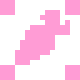

# StaticDaicon



**StaticDaicon** - 静的オブジェクトを表すノード。

---
## **Параметры**:

### - *d3*
<p style="color:#ffb0e0;">StaticBody3D</p>
StaticDaicon のコア。

---
### - *whisker*
<p style="color:#ffb0e0;">Area3D</p>
これは衝突を追跡し、オブジェクトを正しくレンダリングするために **y** および **z-sorting** 連動します。オブジェクトがバリアの後ろにあるかどうかを判定します。

---
### - *shader_cast*
<p style="color:#ffb0e0;">RayCast3D</p>
**ShaderCast** は特別な目的のノードです。その目的は、プレイヤーの前にあるオブジェクトとの衝突を検出し、それに基づいてシェーダーを描画することです。

---
### - *tile_size*
<p style="color:#ffb0e0;">int</p>
タイルサイズとは、3D空間において1メートルに相当するピクセル数を決定するものです。
（要するに、3D空間におけるセルサイズあたりのタイルサイズを指します）

---
### - *y_3d*
<p style="color:#ffb0e0;">int</p>
キャラクターのZ軸上の位置。

---
### - *z_step*
<p style="color:#ffb0e0;">int</p>
Zステップは、高さレベル間のソートシステムにおけるステップです。

例えば、**z_step** = 10の場合、次のように設定されます：

レベル -1 = -10
レベル 0 = 0
レベル 1 = 10
レベル 2 = 20

---
### - *z_sort_coef*
<p style="color:#ffb0e0;">int</p>
オブジェクトの最大3D高さ（メートル単位）。ソート可能なシステムで係数として使用されます。

---
### - *mesh*
<p style="color:#ffb0e0;">MeshInstance3D</p>
カーネルに埋め込まれたメッシュ・ノード・セル（インストール後、3Dセクションで見ることができる）。
セクション「**Core : mesh_properties**」に独自の辞書があります。

---
### - *shape*
<p style="color:#ffb0e0;">Node3D</p>
コアに埋め込まれたシェイプノードのセル（コリジョンに必要）。
**CollisionShape3D** または **CollisionPolygon3D** のみをスキップします。
これは「**Core : shape_properties**」/"の下に独自の辞書を持っています。

---
### *Mesh & Shape-セクション*

「Mesh & Shape」セクションには、MeshとShapeのパラメーターが含まれています。

---
### *Slots-セクション*
<p style="color:#ffb0e0;">Node3D</p>
スロット - 開発者ノードをコアに実装する必要がある場合のセル（コード経由の通信のみ）。

---
### *Core-セクション*
#### - *child_count*
<p style="color:#ffb0e0;">int</p>
カーネルの子ノードの数を常にカウントする。

---
#### - *properties*
<p style="color:#ffb0e0;">Dictionary</p>
セルを介してカーネルに格納されるノードパラメータの辞書。カーネルの子ノードの動的展開に必要なすべてのパラメータを格納する。

---
### *StaticBody-セクション*

カーネルのルート・ノードのパラメータ・セクション。

`(ドキュメントを見る Godot : CharacterBody3D / StaticBody3D)`

---
### *CollisionObject3D-セクション*

カーネルのルート・ノードのパラメータ・セクション。

`(ドキュメントを見る Godot : CollisionObject3D)`

!!!info
	**axis_lock** も含まれる。

---
### *RayCast-セクション*

**Whisker** および **ShaderCast** ノードのパラメーターセクション。

`(Godot のドキュメントを参照：Area3D - RayCast3D)`

---
## **方法**:
## - *_ready*

各起動時にカーネルをデプロイする。ノードの基本設定を行います。

---
### - *_process*

2Dでのノードの移動と3Dでのコアの移動を、エディター内で操作している際に同期します。
また、ゲームプレイ中にz_indexを更新します。

---
### - *update_pos*

```python
func update_pos():
	self.position.x = (d3.position.x - offset_3d.x) * tile_size
	self.position.y = ((d3.position.z - offset_3d.z) - (d3.position.y - offset_3d.y)) * tile_size
```


この関数は，コアの3次元座標を渡して，2次元空間におけるオブジェクトの位置を更新する．

---
### - *_update_z_index*

```python
func _update_z_index():
	if whisker.get_overlapping_bodies():
		if whisker.get_overlapping_bodies()[0].has_meta("z_index"):
			self.z_index = whisker.get_overlapping_bodies()[0].get_meta("z_index") - 1
		else:
			self.z_index = (int(d3.position.y + (offset_3d.y * 1.1))) * z_step - 1
	else:
		self.z_index = ((d3.position.y - offset_3d.y) + z_sort_coef) * z_step + 2
	
	d3.set_meta("z_index", self.z_index)
```

---
### - *get_node_properties*

```java
func get_node_properties(node: Node) -> Dictionary:
	var properties : Dictionary = {
		"Name" : node.name,
		"Class" : node.get_class(),
		"Properties" : {}
	}
	for prop in node.get_property_list():
		if prop.usage & PROPERTY_USAGE_STORAGE:
			properties.Properties[prop.name] = node.get(prop.name)
	return properties
```

この関数は、すべてのノードのパラメータ、名前、クラスを辞書に書き込み、それを返します。

---
### *_expand*

```java
func _expand()  -> void:
	_expand_d3()
	_expand_ray_cast()
	if mesh_properties:
		_expand_mesh()
	if shape_properties:
		_expand_shape()
	_expand_slots()
```

この関数は、カーネルのデプロイメントを扱う。
