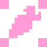

# StaticDaicon

**StaticDaicon** — это нода для неподвижных объектов окружения: стен, камней, деревьев, столбов и заборов.

Внутри неё создается ядро **`StaticBody3D`**. Оно не двигается от физических воздействий, но служит надежной преградой для игрока и физических тел.

---

## Особенности и применение

* **Постоянная конвейерная скорость:** Через свойства `constant_linear_velocity_3d` и `constant_angular_velocity_3d` можно создать эффект конвейерной ленты — тело останется на месте, но будет толкать стоящих на нем персонажей.
* **Автоматический Z-Index:** В отличие от кинематических тел, `StaticDaicon` обновляет свою позицию и слой сортировки автоматически в `_process()`, поэтому вам не нужно писать для неё скрипт управления.

---

## Настройка

1. Добавьте **StaticDaicon** в сцену.
2. В слот **Shape Node** назначьте форму коллизии (`CollisionShape3D`).
3. В слот **Whisker Shape Node** назначьте форму сенсора перекрытия, чтобы персонажи могли корректно скрываться за этим объектом.